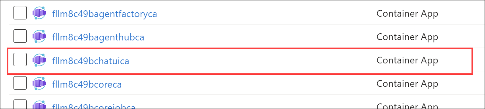
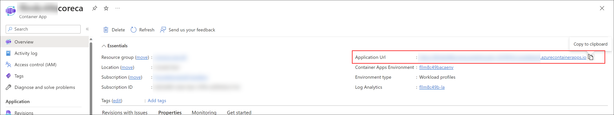
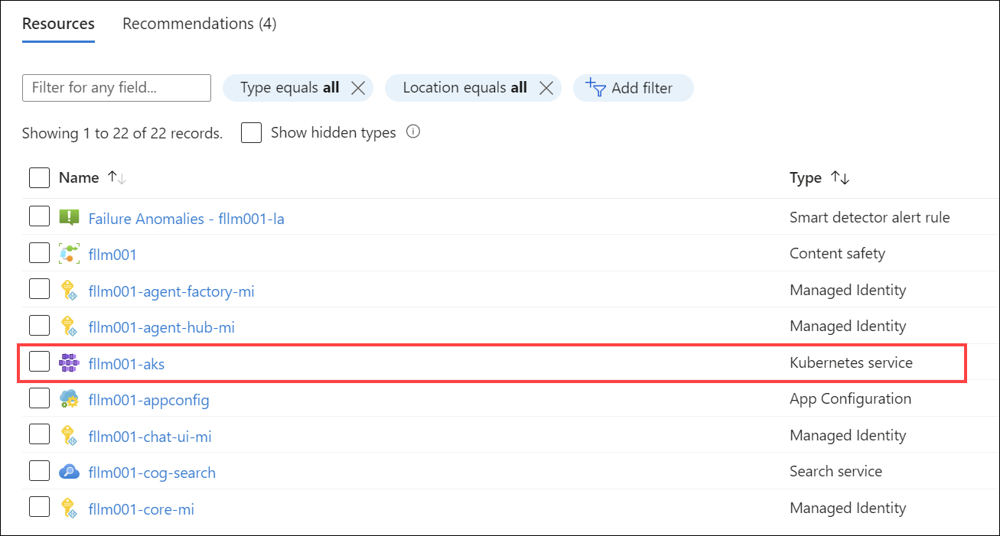
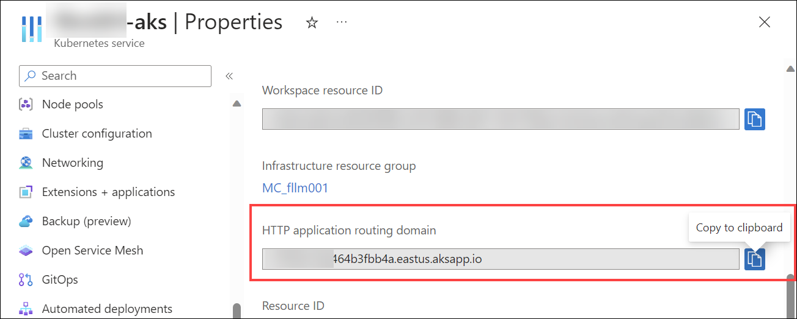

# Finding Your Core API URL

This guide explains how to locate the Core API URL for your FoundationaLLM deployment.

## Azure Container Apps (ACA) Deployment

If you performed an **Azure Container Apps (ACA)** deployment, follow these steps to obtain the URL for the Core API:

1. Within the Resource Group that was created as part of the deployment, select the **Container App** resource whose name ends with `coreca`.

    

2. Within the Overview pane, copy the **Application Url** value. This is the URL for the Core API.

    

## Azure Kubernetes Service (AKS) Deployment

If you performed an **Azure Kubernetes Service (AKS)** deployment, follow these steps to obtain the URL for the Core API:

1. Within the Resource Group that was created as part of the deployment, select the **Kubernetes Service** resource.

    

2. Select **Properties** in the left-hand menu and copy the **HTTP application routing domain** value.

    

    Your Core API URL (for your AKS deployment) is the URL you just copied with `/core` appended to the end of it. For example, if your domain is `https://1cf699fd0d89446eabf2.eastus.aksapp.io/`, then your Core API URL is `https://1cf699fd0d89446eabf2.eastus.aksapp.io/core`.

## Related Topics

- [Core API Overview](index.md)
- [Directly Calling Core API](directly-calling-core-api.md)
- [Local API Access for Standard Deployments](standard-deployment-local-api-access.md)
