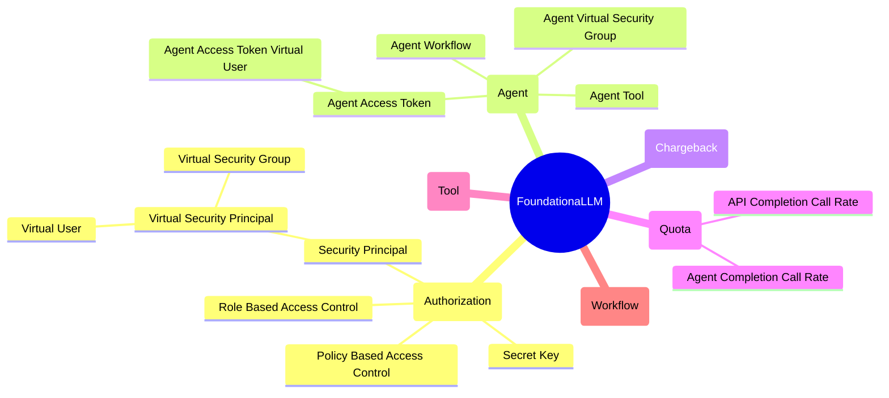

# FoundationaLLM Concepts

The following mindmap provides a high-level overview of the core FoundationaLLM concepts.

- [FoundationaLLM Concepts](#foundationallm-concepts)
  - [Authorization](#authorization)
    - [Secret Key](#secret-key)
    - [Role Based Access Control](#role-based-access-control)
    - [Policy Based Access Control](#policy-based-access-control)
    - [Security Principal](#security-principal)
      - [Virtual Security Principal](#virtual-security-principal)
        - [Virtual User](#virtual-user)
        - [Virtual Security Group](#virtual-security-group)
  - [Agent](#agent)
    - [Agent Workflow](#agent-workflow)
    - [Agent Tool](#agent-tool)
    - [Agent Access Token](#agent-access-token)
      - [Agent Access Token Virtual User](#agent-access-token-virtual-user)
    - [Agent Virtual Security Group](#agent-virtual-security-group)
  - [Chargeback](#chargeback)
  - [Quota](#quota)
    - [API Completion Call Rate](#api-completion-call-rate)
    - [Agent Completion Call Rate](#agent-completion-call-rate)
  - [Tool](#tool)
  - [Workflow](#workflow)

## Authorization

### Secret Key

A secret key is a unique string that is used to authenticate an agent to the FoundationaLLM platform. The secret key is generated by the FoundationaLLM platform and is used to sign requests made by the agent.

### Role Based Access Control

Role-based access control (RBAC) is a method of restricting access to resources based on the roles of users. In RBAC, roles are created and assigned to users, and permissions are assigned to roles.

### Policy Based Access Control

Policy-based access control (PBAC) is a method of restricting access to resources based on policies. In PBAC, policies are created and assigned to users, and permissions are assigned to policies.

### Security Principal

A security principal is an entity that can be authenticated and authorized to access resources. Examples of security principals include users, groups, and service identities.

#### Virtual Security Principal

A virtual security principal is a security principal that is created dynamically by the FoundationaLLM platform. Virtual security principals are used to represent agents and other entities that do not have a direct mapping to a user or group.

##### Virtual User

A virtual user is a virtual security principal that represents an agent access token. Virtual users are created by the FoundationaLLM platform and are used to authenticate agents via agent access tokens.

##### Virtual Security Group

A virtual security group is a virtual security principal that represents the group of agent access tokens created for a user. Virtual security groups are created by the FoundationaLLM platform and are used to manage access control for agents via agent access tokens.

## Agent

### Agent Workflow

An agent workflow drives the core interactions of an agent with its associated tools. It can range from a simple call to an LLM that has function calling capabilities to a complex flow like the LangChain React Agent or an Open AI Assistant.

### Agent Tool

An agent tool is a tool that is associated with an agent. Agent tools can be used to perform various tasks, such as executing code, interacting with APIs, or processing data.

### Agent Access Token

An agent access token is a unique string that is used to authenticate an agent to the FoundationaLLM platform. The agent access token is generated by the FoundationaLLM platform and is used to create a virtual user.

#### Agent Access Token Virtual User

An agent access token virtual user is a virtual user that represents an agent access token. Agent access token virtual users are created by the FoundationaLLM platform and are used to authenticate agents via agent access tokens.

### Agent Virtual Security Group

An agent virtual security group is a virtual security group that represents the group of agent access tokens created for an agent. Agent virtual security groups are created by the FoundationaLLM platform and are used to manage access control for agents via agent access tokens.

## Chargeback

Chargeback is a mechanism for tracking and billing the usage of resources by agents, users, or other entities that can be associated with cost centers. Chargeback allows organizations to allocate costs based on the actual usage of resources by cost center-enabled entities.

## Quota

### API Completion Call Rate

The API call rate is the maximum number of Core API completion calls that a client can make to the Core API within a specified time period. The API call rate is used to limit the rate at which a client can perform completions.

For more details, see [API Completion Call Rate](./quota/api-completion-call-rate.md).

### Agent Completion Call Rate

The API call rate is the maximum number of Core API completion calls that a client can make to the Core API targeting a specific agent within a specified time period. The API call rate is used to limit the rate at which a client can perform completions targeting a specific agent.

For more details, see [Agent Completion Call Rate](./quota/agent-completion-call-rate.md).

## Tool

A tool is a well-defined software component that can be used to perform a specific task as part of the execution of an agent workflow. Tools are used by agents to interact with external systems, process data, or perform other tasks.

## Workflow

A workflow is a sequence of steps that an agent follows to perform a specific task. Workflows can be simple or complex, and can involve multiple tools and interactions with external systems.

