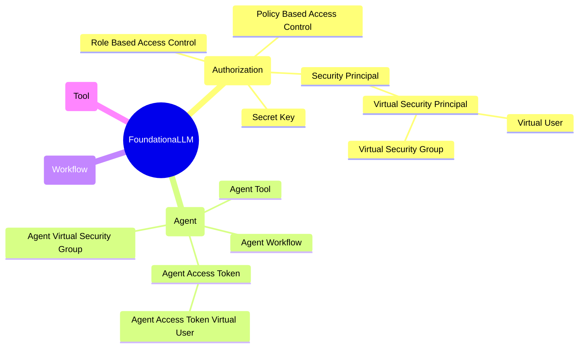

# FoundationaLLM Concepts

The following mindmap provides a high-level overview of the core FoundationaLLM concepts.

```mermaid
mindmap
    root((FoundationaLLM))
    :::link:https://docs.foundationallm.ai
        (Authorization)
            Secret Key
            Role Based Access Control
            Policy Based Access Control
            Security Principal
                Virtual Security Principal
                    Virtual User
                    Virtual Security Group
        (Agent)
            Agent Workflow
            Agent Tool
            Agent Access Token
                Agent Access Token Virtual User
            Agent Virtual Security Group
        (Workflow)
        (Tool)
```