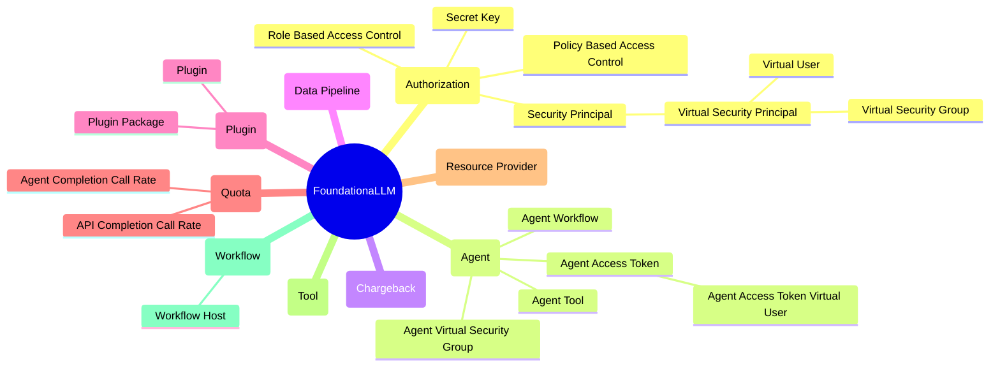

# FoundationaLLM Concepts

The following mindmap provides a high-level overview of the core FoundationaLLM concepts.



- [FoundationaLLM Concepts](#foundationallm-concepts)
  - [Authorization](#authorization)
    - [Secret Key](#secret-key)
    - [Role Based Access Control](#role-based-access-control)
    - [Policy Based Access Control](#policy-based-access-control)
    - [Security Principal](#security-principal)
      - [Virtual Security Principal](#virtual-security-principal)
        - [Virtual User](#virtual-user)
        - [Virtual Security Group](#virtual-security-group)
  - [Agent](#agent)
    - [Agent Workflow](#agent-workflow)
    - [Agent Tool](#agent-tool)
    - [Agent Access Token](#agent-access-token)
      - [Agent Access Token Virtual User](#agent-access-token-virtual-user)
    - [Agent Virtual Security Group](#agent-virtual-security-group)
  - [Chargeback](#chargeback)
  - [Data Pipeline](#data-pipeline)
  - [Plugin](#plugin)
    - [Plugin Package](#plugin-package)
    - [Plugin](#plugin-1)
  - [Quota](#quota)
    - [API Completion Call Rate](#api-completion-call-rate)
    - [Agent Completion Call Rate](#agent-completion-call-rate)
  - [Resource Provider](#resource-provider)
  - [Tool](#tool)
  - [Workflow](#workflow)
    - [Workflow Host](#workflow-host)

## Authorization

### Secret Key

A secret key is a unique string that is used to authenticate an agent to the FoundationaLLM platform. The secret key is generated by the FoundationaLLM platform and is used to sign requests made by the agent.

### Role Based Access Control

Role-based access control (RBAC) is a method of restricting access to resources based on the roles of users. In RBAC, roles are created and assigned to users, and permissions are assigned to roles.

### Policy Based Access Control

Policy-based access control (PBAC) is a method of restricting access to resources based on policies. In PBAC, policies are created and assigned to users, and permissions are assigned to policies.

### Security Principal

A security principal is an entity that can be authenticated and authorized to access resources. Examples of security principals include users, groups, and service identities.

#### Virtual Security Principal

A virtual security principal is a security principal that is created dynamically by the FoundationaLLM platform. Virtual security principals are used to represent agents and other entities that do not have a direct mapping to a user or group.

##### Virtual User

A virtual user is a virtual security principal that represents an agent access token. Virtual users are created by the FoundationaLLM platform and are used to authenticate agents via agent access tokens.

##### Virtual Security Group

A virtual security group is a virtual security principal that represents the group of agent access tokens created for a user. Virtual security groups are created by the FoundationaLLM platform and are used to manage access control for agents via agent access tokens.

## Agent

### Agent Workflow

An agent workflow drives the core interactions of an agent with its associated tools. It can range from a simple call to an LLM that has function calling capabilities to a complex flow like the LangChain React Agent or an Open AI Assistant.

### Agent Tool

An agent tool is a tool that is associated with an agent. Agent tools can be used to perform various tasks, such as executing code, interacting with APIs, or processing data.

### Agent Access Token

An agent access token is a unique string that is used to authenticate an agent to the FoundationaLLM platform. The agent access token is generated by the FoundationaLLM platform and is used to create a virtual user.

#### Agent Access Token Virtual User

An agent access token virtual user is a virtual user that represents an agent access token. Agent access token virtual users are created by the FoundationaLLM platform and are used to authenticate agents via agent access tokens.

### Agent Virtual Security Group

An agent virtual security group is a virtual security group that represents the group of agent access tokens created for an agent. Agent virtual security groups are created by the FoundationaLLM platform and are used to manage access control for agents via agent access tokens.

## Chargeback

Chargeback is a mechanism for tracking and billing the usage of resources by agents, users, or other entities that can be associated with cost centers. Chargeback allows organizations to allocate costs based on the actual usage of resources by cost center-enabled entities.

## Data Pipeline

A FoundationaLLM data pipeline defines a process that aims to extract data from a data source, transform it to make it suitable for LLM-based workloads (e.g., extracting text, partitioning text, extracting entities and relationships, embedding text, creating knowledge graphs, etc.), and load it into a target system (e.g., vector store, knowledge store, etc.). Data pipelines can be managed using the FoundationaLLM Management Portal (interactively) or the FoundationaLLM Management API (programmatically).

FoundationaLLM data pipelines are built from the ground up to address the following key requirements for enterprise-grade Generative AI workloads:
- **Scalability** - handle large volumes of data and scale horizontally to meet the demands of enterprise workloads. FoundationaLLM data pipelines are designed to handle anything from a few documents or records to millions of documents or records.
- **Flexibility** - have a flexible and modular structure that is suitable from complex processing, parallelization of work, scalability, and reusability of components.
- **Local and Global Processing** - support local processing of data (e.g., text extraction, text partitioning, entity extraction, relationship extraction, etc.) and global processing of data (e.g., assembly of knowledge graphs).
- **Parameterization** - allow the configuration of data pipelines using parameters that can be set at runtime. This avoids the need to create multiple data pipelines for different configurations (e.g., a single data pipeline definition can be used to handle all user file uploads in the User Portal).
- **Extensiblity** - enable the addition of new data pipeline stages and the modification of existing data pipeline stages to meet the specific requirements of different use cases. All data pipeline components are implemented using plugins.

For more details, see [Data Pipelines](./data-pipeline/data-pipeline.md).

## Plugin

A plugin is a software component that can be used to extend the functionality of the FoundationaLLM platform. Plugins can be used to add new features, integrate with external systems, or perform other tasks. Plugins can be managed using the FoundationaLLM Management Portal (interactively) or the FoundationaLLM Management API (programmatically).

### Plugin Package

A FoundationaLLM plugin package is a unit of versioning and deployment of one or more plugins. The Management Portal and Management API allow you to manage plugin packages. The following types of plugin packages are supported by the FoundationaLLM platform:

Platform | Package Type | Description
--- | --- | ---
Python | ZIP package | The package can contain agent workflow and agent tool plugins that can be used through a workflow/tool plugin manager. This package type in not currently supported by Management API. It is scheduled to be replaced by a new type of Python package (Wheel) that will be fully supported by Management API.
.NET | NuGet package | The package can contain data source, data pipeline stage, content text extraction, and content text partitioning plugins that can be used by the data pipelines infrastructure. This package type is fully supported by Management API.

For more details, see [Plugin Packages](./plugin/plugin-package.md).

### Plugin

The following types of plugins are supported by the FoundationaLLM platform:

Platform | Category | Description
--- | --- | ---
Python | `Agent Workflow` | A Python agent workflow plugin implements an agent workflow that runs in the LangChain API and is responsible for driving the proccess of tool invocation and response generation.
Python | `Agent Tool` | A Python agent tool plugin implement an agent tool that can be associated with an agent that uses a workflow that runs the LangChain workflow host (LangChain API).
.NET | `Data Source` | A .NET data source plugin implements a data source that can be used to retrieve data from an external system and make it available to data pipelines.
.NET | `Data Pipeline Stage` | A .NET data pipeline stage plugin implements a stage that can be executed as part of a data pipeline.
.NET | `Content Text Extraction` | A .NET content text extraction plugin implements a content text extraction process that can be used to extract text from binary content (corresponding to various formats like PDF, DOCX, images, etc.).
.NET | `Content Text Partitioning` | A .NET content text partitioning plugin implements a content text partitioning process that can be used to partition text into segments based on a specific strategy (e.g., token-based or semantic).

For more details, see [Plugins](./plugin/plugin.md).

## Quota

### API Completion Call Rate

The API call rate is the maximum number of Core API completion calls that a client can make to the Core API within a specified time period. The API call rate is used to limit the rate at which a client can perform completions.

For more details, see [API Completion Call Rate](./quota/api-completion-call-rate.md).

### Agent Completion Call Rate

The API call rate is the maximum number of Core API completion calls that a client can make to the Core API targeting a specific agent within a specified time period. The API call rate is used to limit the rate at which a client can perform completions targeting a specific agent.

For more details, see [Agent Completion Call Rate](./quota/agent-completion-call-rate.md).

## Resource Provider

A resource provider is a platform component that is responsible for managing resources in the FoundationaLLM platform. Resource providers are used to create, update, delete, and retrieve resources such as agents, prompts, data sources, data pipelines, plugins and many more. All resource types available in the FoundationaLLM platform are managed by resource providers. The following resource providers are supported by the FoundationaLLM platform:

Name | Description
--- | ---
`FoundationaLLM.Agent` | Manages agents, agent workflows, agent tool, agent access tokens and other agent-related artifacts.
`FoundationaLLM.AIModel` | Manages AI models used across the platform.
`FoundationaLLM.Attachment` | Manages attachments that are uploaded by users through the User Portal or programmatically using Core API.
`FoundationaLLM.Authorization` | Manages the authorization artifacts like roles, policies, and permissions.
`FoundationaLLM.AzureOpenAI` | Manages artifacts related to the Azure OpenAI integration (e.g., Assistants files, vector stores, threads, etc.).
`FoundationaLLM.Configuration` | Manages the configuration settings of the FoundationaLLM platform. This includes settings from Azure App Configuration and API endpoint configurations.
`FoundationaLLM.DataPipeline` | Manages data pipelines, data pipeline stages, data pipeline runs, and other data pipeline-related artifacts.
`FoundationaLLM.DataSource` | Manages data sources and other data source-related artifacts.
`FoundationaLLM.Plugin` | Manages plugin packages and plugins.
`FoundationaLLM.Prompt` | Manages prompts and other prompt-related artifacts.

## Tool

A tool is a well-defined software component that can be used to perform a specific task as part of the execution of an agent workflow. Tools are used by agents to interact with external systems, process data, or perform other tasks.

## Workflow

A workflow is a sequence of steps that an agent follows to perform a specific task. Workflows can be simple or complex, and can involve multiple tools and interactions with external systems.

### Workflow Host

A workflow host is an environment that runs agent workflows. The workflow host is responsible for executing agent workflows, managing the execution of tools, and handling the interactions between agents and external systems.

The following workflow hosts are supported by the FoundationaLLM platform:

Name | Platform | Description
--- | --- | ---
LangChain | LangChain API (Python) | The LangChain API is a Python-based workflow host that runs agent workflows using the LangChain orchestrator.
SemanticKernel | Semantic Kernel API (.NET) | The Semantic Kernel API is a .NET-based workflow host that runs agent workflows using the Semantic Kernel orchestrator.
```

