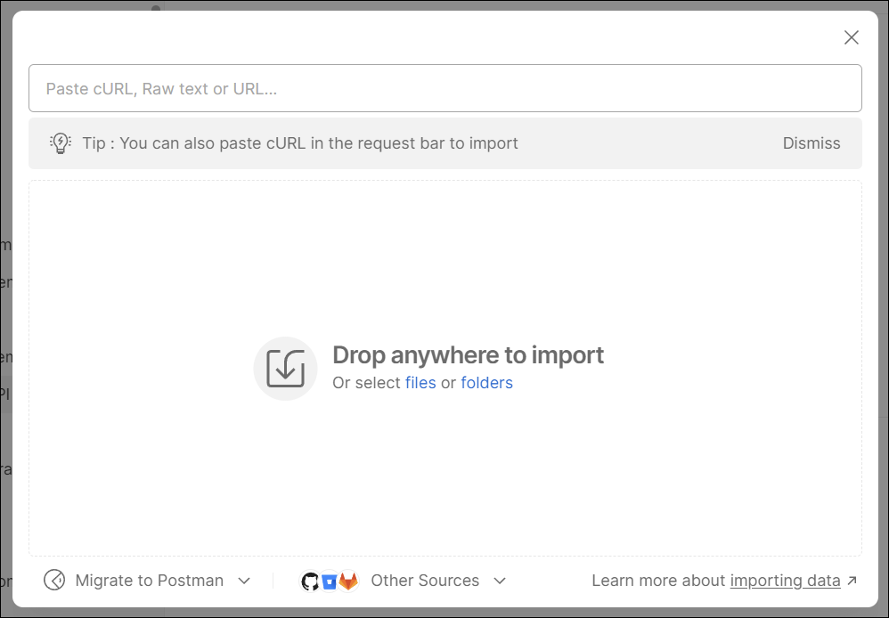
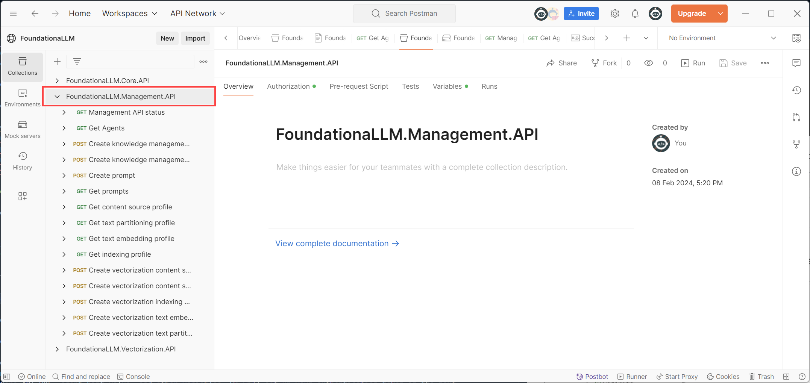
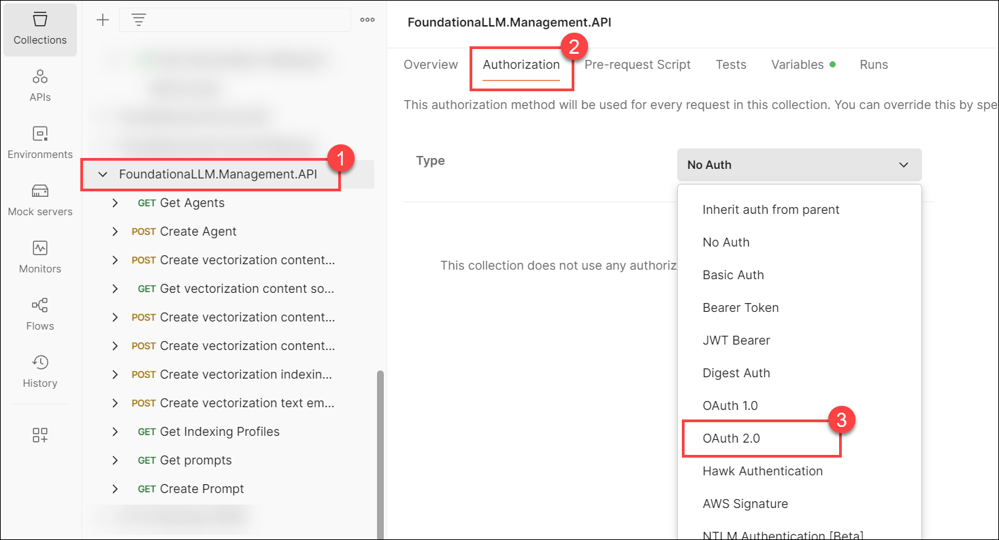
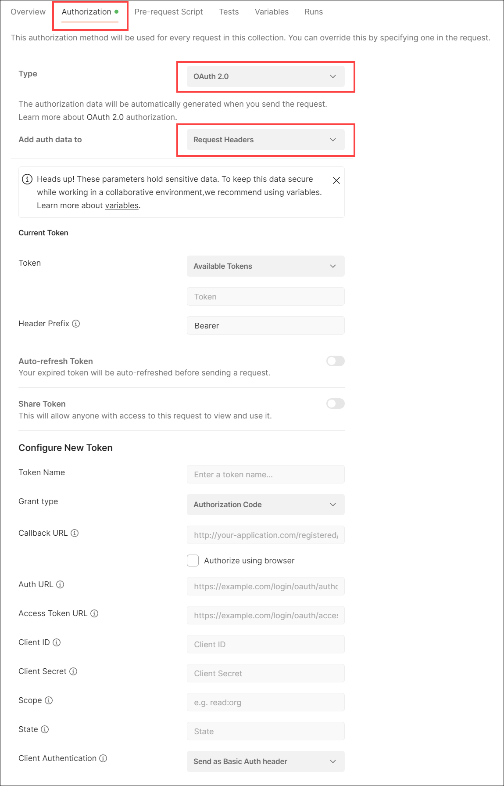
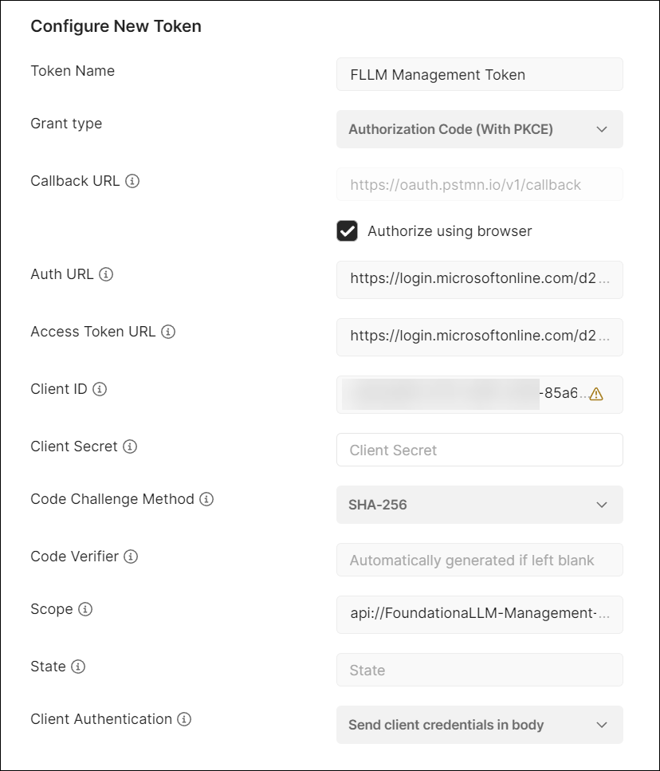

# Directly calling the Management API

This guide provides steps for importing and configuring the Postman collection for the FoundationaLLM Management API. The Management API is used to manage the FoundationaLLM system, including creating and managing agents, vectorization profiles, and more. Once you configure the Postman collection, including authentication, follow the instructions in the links below to perform various operations using the Management API:

- [Managing agents](../../setup-guides/agents/index.md)
- [Vectorization management](../../setup-guides/vectorization/index.md)

## Postman collection

The ability to test the API endpoints of FoundationaLLM is a critical part of the development process. Postman is a tool that allows you to do just that. This document will walk you through the process of setting up Postman to work with FoundationaLLM.

> [!TIP]
> To find the Management API URL for your deployment, you can retrieve it from your App Configuration resource in the portal by viewing the `FoundationaLLM:APIs:ManagementAPI:APIUrl` configuration value.

To see the API endpoints available in FoundationaLLM, you can get your Management API endpoint from your App Configuration resource in the portal and add `/swagger/` to the end of it. For example, if your Core API endpoint is `https://fllmaca729managementca.icelake-c554b849.eastus.azurecontainerapps.io`, then you would navigate to `https://fllmaca729managementca.icelake-c554b849.eastus.azurecontainerapps.io/swagger/` to see the API endpoints.

> [!NOTE]
> The example link above is for a [starter deployment](../deployment/deployment-starter.md) of FoundationaLLM, which deploys the APIs to Azure Container Apps (ACA). If you are using the standard deployment that deploys the APIs to Azure Kubernetes Service (AKS), then you cannot currently access the Swagger UI for the APIs. However, you will be able to obtain the OpenAPI swagger.json file from the Management API endpoint by navigating to `https://{{AKS URL}}/management/swagger/v1/swagger.json`.

### Install Postman

If you don't have Postman installed on your machine, visit the [Postman website](https://www.getpostman.com/) and download the app. Once you have it installed, Create a Blank Workspace.

### Import the Postman collection

1. First, [download the Management API Postman collection](https://github.com/solliancenet/foundationallm/blob/main/docs/FoundationaLLM.Management.API.postman_collection.json) and save it to your machine. To download it from GitHub, select **Download raw file**.

2. To import the Postman collection, click **Import** in the top left corner of the Postman app.

    

3. Within the dialog that displays, drag and drop or navigate to the Postman collection file you downloaded in the first step.

    

You will now see the **FoundationaLLM.Management.API** collection in your Postman workspace.

### Set up the Postman environment variables

The Postman collection you imported contains a number of API endpoints that you can use to test the Core API. However, before you can use these endpoints, you need to set up a Postman environment variables within your collection that contains the Core API URL, agent hint value, and other variables. We will set up your authentication token in the next section.

1. Select the **FoundationaLLM.Core.API** collection in the left-hand menu.

2. Select the **Variables** tab.

    

    > [!NOTE]
    > The `Initial value` column is the value that will be used when you first import the collection. The `Current value` column is the value that will be used when you run the collection. If you change the `Current value` column, the `Initial value` column will not be updated. For the steps that follow, you will be updating the `Current value` column.

3. Update the `baseUrl` variable `Current value` with the Core API URL for your deployment.

    

4. Update the `instanceId` variable `Current value` with the instance ID of your FoundationaLLM deployment. You can find the instance ID in the `FoundationaLLM:Instance:Id` Azure App Configuration property.

    

5. Select the **Save** button in the top right corner of the Variables pane to save your changes.

    

### Set up the Postman authentication token

#### Configure the Postman collection authorization token

Complete these steps to configure Postman to use the same token for all of the API calls in the collection.

> [!IMPORTANT]
> If you previously configured the Microsoft Entra ID app registration for the Management Client (UI) application, you will need to update the **Redirect URI** to `https://oauth.pstmn.io/v1/callback` in order to use the Postman mobile app to get the token. You can do this by following the steps in the [Add a redirect URI to the client application](../../deployment/authentication/management-authentication-setup-entra.md#add-a-redirect-uri-to-the-client-application) section of the authentication setup guide.

First, let's set up the request to get the token at the **collection** level. Make sure you choose `OAuth 2.0` as the type of authorization and **not** Bearer Token.

This is how the **Authorization** tab should look like **before** the entries that you will need to change.

Below is a list of each change that you need to make to the **Authorization** tab:

1. **Token Name:** This is the name of the token that you will use in the **Headers** tab. You can name it whatever you want, for example: **FLLM Management Token**.
2. **Grant Type:** This is the type of grant that you will use to get the token. In our case, we will use **Authorization Code (with PKCE)**. PKCE stands for **Proof Key for Code Exchange**. It's an extension to the OAuth 2.0 protocol that helps prevent authorization code interception attacks. PKCE is a lightweight mechanism that can be used in any application that requests an authorization code.
3. **Callback Url:** Click on the "Authhorize using browser" checkbox and it will automatically fill in the url for Postman mobile call back `https://oauth.pstmn.io/v1/callback`.

    

4. **Auth Url:** This is the url that you will use to get the token.  In our case, it's the url of Microsoft microsoftonline login authority `https://login.microsoftonline.com/<tenantID>/oauth2/v2.0/authorize`. Replace the **tenantID** with your own Entra ID Tenant ID from your portal or from the App Configuration resource.
5. **Access Token Url:** This is the url that you will use to get the access token.  In our case, it's the url of Microsoft microsoftonline login authority `https://login.microsoftonline.com/<tenantID>/oauth2/token`. Replace the **tenantID** with your own Entra ID Tenant ID from your portal or from the App Configuration resource.
6. **Client ID:** This is the client ID of the application that you will use to get the token. In our case, it's the client ID of the Management Client (UI) application. You can get the client ID from the **Overview** tab of the Management Client application in the portal.
7. **Code Challenge Method:** This is the method that you will use to get the token. In our case, we will use **SHA-256**.
8. **Scope:** This is the scope of the token that you will use to get the token. You can find this value within the Api Permissions section of your Management Client Entra ID app. In our case, we will use **api://FoundationaLLM-Management-Auth/Data.Manage**.
9. **Client Authentication:** This is the type of authentication that you will use to get the token.  In our case, we will use **Send client credentials in body**.

These are the only changes that you need to make to the **Authorization** tab.  

Scroll down to the bottom of the page and click on **Get New Access Token**. This will open a new window in your browser and will ask you to login with your credentials.  Once you login, you will be asked to consent to the permissions that you specified in the **Scope** field.  Click on **Accept** to consent to the permissions.  You will then be redirected to the callback url that you specified in the **Callback Url** field.  This will close the browser window and will take you back to Postman. You should now see the token in the **Authorization** tab. Click on **Use Token** to use the token in the collection.

> [!IMPORTANT]
> Be sure to click the **Save** button in the top right corner of the Postman app to save your changes.

Now you are ready to make your first ManagementAPI request.

Within the **FoundationaLLM.Management.API** collection, select the **Get Agents** GET request. When you select the `Authorization` tab, notice that the selected type is `Inherit auth from parent`. This means that the request will use the token that you configured at the collection level. Also notice that the `{{baseUrl}}` and `{{instanceId}}` variables is used in the `Request Url` field. This means that the request will use the Management API URL and Instance Id that you configured at the collection level. Select the **Send** button to send the request. Even if you do not have any agents sessions in your system, you should receive a successful response (200) from the Management API.

Now you can use the same token to test any other request in the collection with ease.
