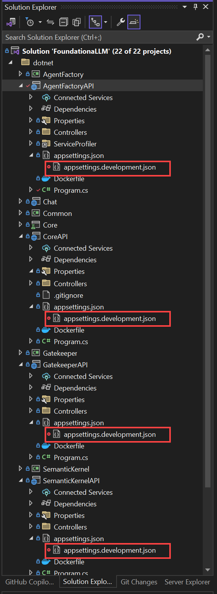
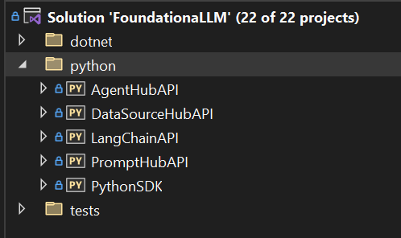
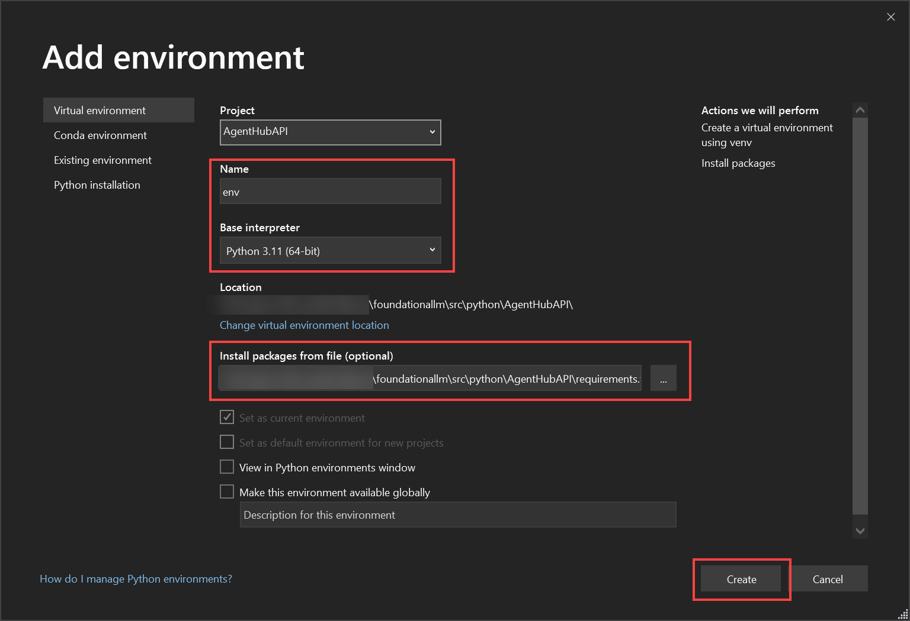
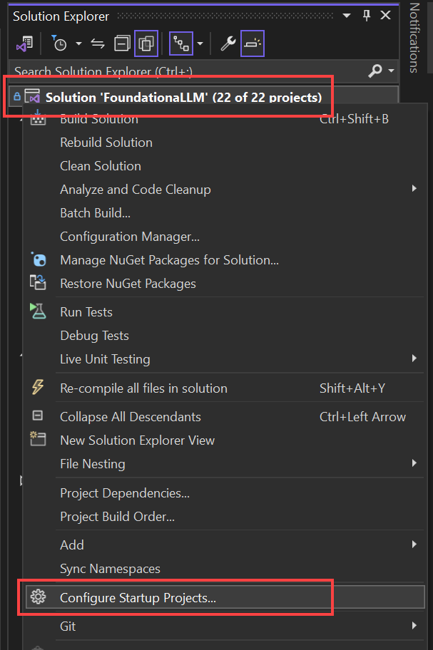
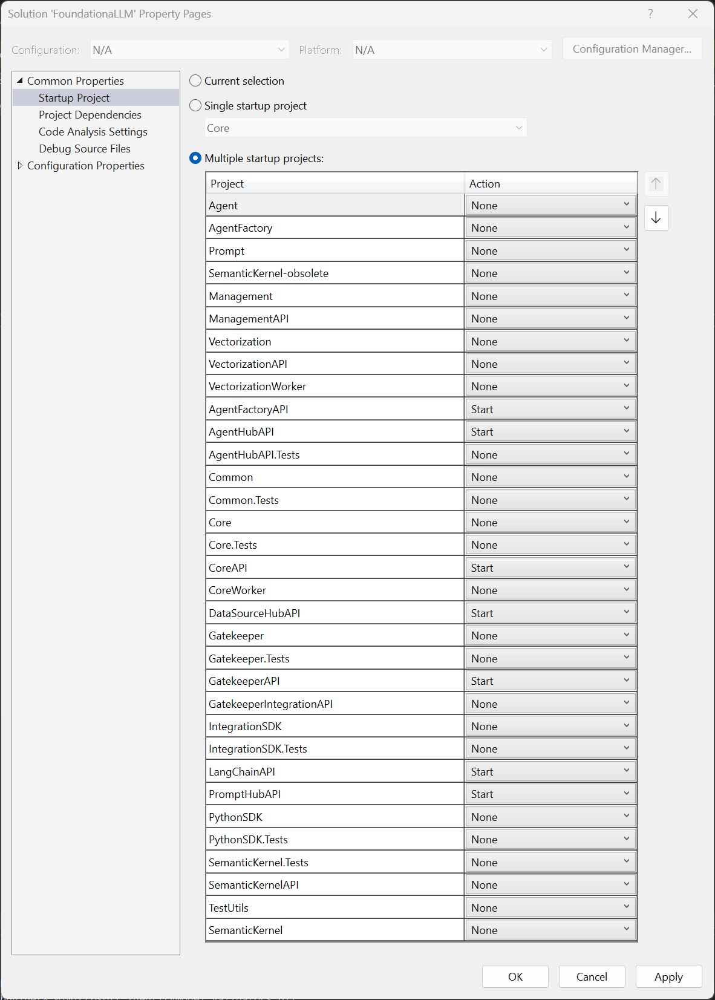

# Configure local development environment

- [Configure local development environment](#configure-local-development-environment)
  - [Prerequisites](#prerequisites)
  - [UI](#ui)
    - [User Portal](#user-portal)
    - [Chat (deprecated)](#chat-deprecated)
      - [Chat app settings](#chat-app-settings)
  - [.NET projects](#net-projects)
    - [Core API](#core-api)
      - [Core API app settings](#core-api-app-settings)
    - [Gatekeeper API](#gatekeeper-api)
      - [Gatekeeper API app settings](#gatekeeper-api-app-settings)
    - [Agent Factory API](#agent-factory-api)
      - [Agent Factory API app settings](#agent-factory-api-app-settings)
    - [Semantic Kernel API](#semantic-kernel-api)
      - [Semantic Kernel API app settings](#semantic-kernel-api-app-settings)
  - [Python projects](#python-projects)
    - [Python Environment Variables](#python-environment-variables)
    - [Agent Hub API](#agent-hub-api)
      - [Agent Hub API Environment Variables](#agent-hub-api-environment-variables)
    - [Data Source Hub API](#data-source-hub-api)
      - [Data Source Hub API Environment Variables](#data-source-hub-api-environment-variables)
    - [Prompt Hub API](#prompt-hub-api)
      - [Prompt Hub API Environment Variables](#prompt-hub-api-environment-variables)
    - [LangChain API](#langchain-api)
      - [LangChain API Environment Variables](#langchain-api-environment-variables)
  - [Running the solution locally](#running-the-solution-locally)
    - [Configure and run the backend components](#configure-and-run-the-backend-components)
    - [Configure and run the frontend components](#configure-and-run-the-frontend-components)

## Prerequisites

- Environment variables:
  - Create an environment variable for the Application Configuration Service connection string named `FoundationaLLM:AppConfig:ConnectionString`. This is used by the .NET projects.
  - Create an environment variable for the Application Configuration Service URI named `foundationallm-app-configuration-uri`. This is used by the Python projects.
- Backend (APIs and worker services):
  - Visual Studio 2022 17.6 or later (required for passthrough Visual Studio authentication for the Docker container) with the [Python workload installed](https://learn.microsoft.com/visualstudio/python/installing-python-support-in-visual-studio?view=vs-2022)
  - [.NET 7 SDK](https://dotnet.microsoft.com/download/dotnet) or greater
  - [Python 3.11](https://www.python.org/downloads/) or greater (learn more about [Python environments in Visual Studio](https://learn.microsoft.com/visualstudio/python/managing-python-environments-in-visual-studio?view=vs-2022))
  - Docker Desktop (with WSL for Windows machines) ([Mac install](https://docs.docker.com/desktop/install/mac-install/) or [Windows install](https://docs.docker.com/desktop/install/windows-install/))
  - Azure CLI ([v2.51.0 or greater](https://learn.microsoft.com/cli/azure/install-azure-cli))
  - [Helm 3.11.1 or greater](https://helm.sh/docs/intro/install/)
- Frontend (Vue.js (Nuxt) web app)
  - [Visual Studio Code](https://code.visualstudio.com/Download) (recommended for development)
  - [Node.js](https://nodejs.org/en/) v18.0.0 or newer
  - [NPM](https://www.npmjs.com/)
  - Recommended way to install the latest version of NPM and node.js on Windows:
    - Install NVM from https://github.com/coreybutler/nvm-windows
    - Run nvm install latest
    - Run nvm list (to see the versions of NPM/node.js available)
    - Run nvm use latest (to use the latest available version)

## UI

### User Portal

The `UserPortal` project is a Vue.js (Nuxt) project. To configure it to run locally, follow these steps:

1. Open the `/src/UserPortal` folder in Visual Studio Code.
2. Copy the `.env.example` file in the root directory to a new file named `.env` and update the values:
   1. The `APP_CONFIG_ENDPOINT` value should be the Connection String for the Azure App Configuration service. This should be the same value as the `FoundationaLLM:AppConfig:ConnectionString` environment variable.
   2. The `LOCAL_API_URL` should be the URL of the local Core API service (https://localhost:63279). **Important:** Only set this value if you wish to debug the entire solution locally and bypass the App Config service value for the CORE API URL. If you do not wish to debug the entire solution locally, leave this value empty or comment it out.

### Chat (deprecated)

The `Chat` Blazor web app is deprecated and will be removed in a future release. It is only included in the solution for reference purposes.

#### Chat app settings

> Make sure the contents of the `appsettings.json` file has this structure and similar values:

```json
{
  "DetailedErrors": true,
  "Logging": {
    "LogLevel": {
      "Default": "Information",
      "Microsoft.AspNetCore": "Warning"
    }
  },
  "AllowedHosts": "*",
  "FoundationaLLM": {
    "AppConfig": {
      "ConnectionString": ""
    }
  }
}
```

> Create the `appsettings.Development.json` file or update it with the following content and replace all `<...>` placeholders with the values from your deployment:

```json
{
  "FoundationaLLM": {
    "APIs": {
      "CoreAPI": {
        "APIUrl": "<...>"
      },
    } 
  }
 }

```

## .NET projects

### Core API

#### Core API app settings

> Make sure the contents of the `appsettings.json` file has this structure and similar values:

```json
{
  "DetailedErrors": true,
  "Logging": {
    "LogLevel": {
      "Default": "Information",
      "Microsoft.AspNetCore": "Warning"
    }
  },
  "AllowedHosts": "*",
  "FoundationaLLM": {
    "AppConfig": {
      "ConnectionString": ""
    }
  }
}
```

> Create the `appsettings.Development.json` file or update it with the following content and replace all `<...>` placeholders with the values from your deployment:

```json
{  
  "APIs": {
    "GatekeeperAPI": {
      "APIUrl": "<...>" // Default local value: https://localhost:7180/
    }
  }
}
```

### Gatekeeper API

#### Gatekeeper API app settings

> Make sure the contents of the `appsettings.json` file has this structure and similar values:

```json
{
  "Logging": {
    "LogLevel": {
      "Default": "Information",
      "Microsoft.AspNetCore": "Warning"
    },
    "ApplicationInsights": {
      "LogLevel": {
        "Default": "Information",
        "Microsoft.AspNetCore": "Warning"
      }
    }
  },
  "AllowedHosts": "*",
  "FoundationaLLM": {
    "AppConfig": {
      "ConnectionString": ""
    }
  }
}
```

> Create the `appsettings.Development.json` file or update it with the following content and replace all `<...>` placeholders with the values from your deployment:

```json
{
  "FoundationaLLM": {
    "APIs": {
      "AgentFactoryAPI": {
        "APIUrl": "<...>"  // Default local value: https://localhost:7324/
      }
    }
  }
}
```

### Agent Factory API

#### Agent Factory API app settings

> Make sure the contents of the `appsettings.json` file has this structure and similar values:

```json
{
  "Logging": {
    "LogLevel": {
      "Default": "Information",
      "Microsoft.AspNetCore": "Warning"
    },
    "ApplicationInsights": {
      "LogLevel": {
        "Default": "Information",
        "Microsoft.AspNetCore": "Warning"
      }
    }
  },
  "AllowedHosts": "*",
  "FoundationaLLM": {
    "AppConfig": {
      "ConnectionString": ""
    }
  }
}
```

> Create the `appsettings.Development.json` file or update it with the following content and replace all `<...>` placeholders with the values from your deployment:

```json
{
  "FoundationaLLM": {
    "APIs": {
      "LangChainAPI": {
        "APIUrl": "<...>"  // Default local value: http://localhost:8765/
      },
      "SemanticKernelAPI": {
        "APIUrl": "<...>"  // Default local value: https://localhost:7062/
      },
      "AgentHubAPI": {
        "APIUrl": "<...>"  // Default local value: http://localhost:8742/
      },
      "PromptHubAPI": {
        "APIUrl": "<...>"  // Default local value: http://localhost:8642/
      },
      "DataSourceHubAPI": {
        "APIUrl": "<...>"  // Default local value: http://localhost:8842/
      }
    }
  }
}
```

### Semantic Kernel API

#### Semantic Kernel API app settings

> Make sure the contents of the `appsettings.json` file has this structure and similar values:

```json
{
  "Logging": {
    "LogLevel": {
      "Default": "Information",
      "Microsoft.AspNetCore": "Warning",
      "Microsoft.SemanticKernel": "Error"
    },
    "ApplicationInsights": {
      "LogLevel": {
        "Default": "Information",
        "Microsoft.AspNetCore": "Warning",
        "Microsoft.SemanticKernel": "Error"
      }
    }
  },
  "AllowedHosts": "*",
  "FoundationaLLM": {
    "CognitiveSearch": {
      "IndexName": "vector-index",
      "MaxVectorSearchResults": 10
    },
    "OpenAI": {
      "CompletionsDeployment": "completions",
      "CompletionsDeploymentMaxTokens": 8096,
      "EmbeddingsDeployment": "embeddings",
      "EmbeddingsDeploymentMaxTokens": 8191,
      "ChatCompletionPromptName": "RetailAssistant.Default",
      "ShortSummaryPromptName": "Summarizer.TwoWords",
      "PromptOptimization": {
        "CompletionsMinTokens": 50,
        "CompletionsMaxTokens": 300,
        "SystemMaxTokens": 1500,
        "MemoryMinTokens": 1500,
        "MemoryMaxTokens": 3000,
        "MessagesMinTokens": 100,
        "MessagesMaxTokens": 3000
      }
    },
    "DurableSystemPrompt": {
      "BlobStorageContainer": "prompts"
    },
    "CognitiveSearchMemorySource": {
      "IndexName": "vector-index",
      "ConfigBlobStorageContainer": "memory-source",
      "ConfigFilePath": "ACSMemorySourceConfig.json"
    },
    "BlobStorageMemorySource": {
      "ConfigBlobStorageContainer": "memory-source",
      "ConfigFilePath": "BlobMemorySourceConfig.json"
    },
    "SemanticKernelOrchestration": {
      "APIKeySecretName": "foundationallm-semantickernel-api-key"
    }
  }
}
```

> Create the `appsettings.Development.json` file or update it with the following content and replace all `<...>` placeholders with the values from your deployment:

```json
{
  "FoundationaLLM": {
    "CognitiveSearch": {
      "Endpoint": "https://<...>-cog-search.search.windows.net",
      "Key": "<...>"
    },
    "OpenAI": {
      "Endpoint": "https://<...>-openai.openai.azure.com/",
      "Key": "<...>"
    },
    "DurableSystemPrompt": {
      "BlobStorageConnection": "<...>"
    },
    "CognitiveSearchMemorySource": {
      "Endpoint": "https://<...>-cog-search.search.windows.net",
      "Key": "<...>",
      "ConfigBlobStorageConnection": "<...>"
    },
    "BlobStorageMemorySource": {
      "ConfigBlobStorageConnection": "<...>"
    }
  }
}
```

## Python projects

### Python Environment Variables

Create a local environment variable named `foundationallm-app-configuration-uri`. The value should be the URI of the Azure App Configuration service and _not_ the connection string. We use role-based access controls (RBAC) to access the Azure App Configuration service, so the connection string is not required.

| Name | Value | Description |
| ---- | ----- | ----------- |
| foundationallm-app-configuration-uri | REDACTED | Azure App Configuration URI |

### Agent Hub API

#### Agent Hub API Environment Variables

| Name | Value | Description |
| ---- | ----- | ----------- |

### Data Source Hub API

#### Data Source Hub API Environment Variables

| Name | Value | Description |
| ---- | ----- | ----------- |

### Prompt Hub API

#### Prompt Hub API Environment Variables

| Name | Value | Description |
| ---- | ----- | ----------- |

### LangChain API

#### LangChain API Environment Variables

| Name | Value | Description |
| ---- | ----- | ----------- |

## Running the solution locally

### Configure and run the backend components

The backend components consist of the .NET projects and the Python projects. The .NET projects are all ASP.NET Core Web API projects. The Python projects are all FastAPI projects.

1. Open the solution in Visual Studio 2022 17.6 or later. The solution file is located at `/src/FoundationaLLM.sln`.
2. Reference the API sections above to configure the app settings for each project. This primarily involves just creating the `appsettings.development.json` file for each of the .NET (located under the `dotnet` solution folder) API projects and adding the documented values within. For local development, use the `localhost` URLs for each of the API projects.

    > [!NOTE]
    > The `appsettings.development.json` files are excluded from source control. This is to prevent sensitive information from being committed to source control. You will need to create these files locally.

    

3. Expand the `python` solution folder.

    

4. Expand the `AgentHubAPI` project, then expand the `Python Environments` folder underneath it. You will likely see a warning icon next to an environment named `env`. This is because the Python environment has not been created yet.

    

5. Right-click the `Python Environments` folder and select `Add Environment...`.

    

6. Ensure the **Name** field is set to `env` and the **Version** field is set to `Python 3.11` (or your latest version). Also make sure the **Install packages from file** field is set to the `requirements.txt` file for the project. This will install the required Python packages after creating the environment. Click **Create**.

    

7. You should now see the `env` environment listed under the `Python Environments` folder. The warning icon should be gone.

    

8. Complete steps 4-7 for the `DataSourceHubAPI`, `LangChainAPI`, `PromptHubAPI`, and `PythonSDK` projects. You may optionally complete these steps for the Python test projects as well.

9. Right-click the Solution in Visual Studio, then select `Configure Startup Projects...`.

    

10. Select the `Multiple startup projects` option, then set the `Action` for the following projects to `Start`. Click **OK**.
  
      - AgentFactoryAPI
      - AgentHubAPI
      - CoreAPI
      - DataSourceHubAPI
      - GatekeeperAPI
      - LangChainAPI
      - PromptHubAPI
      - SemanticKernelAPI
  
      

11. Press `F5` to start debugging the solution. This will start all of the .NET projects and the Python projects. The Vue.js (Nuxt) web app will not be started by default. To start it, follow the steps below.

### Configure and run the frontend components

The frontend components consist of the Vue.js (Nuxt) web app.

1. Open the `/src/UserPortal` folder in Visual Studio Code.

2. Open the `.env` file and update the `LOCAL_API_URL` value to the URL of the local Core API service (https://localhost:63279). **Important:** Only set this value if you wish to debug the entire solution locally and bypass the App Config service value for the CORE API URL. If you do not wish to debug the entire solution locally, leave this value empty or comment it out.

3. Open a terminal in Visual Studio Code and run the following commands:

    ```bash
    npm install
    npm run dev
    ```

4. The web app should now be running at http://localhost:3000.
