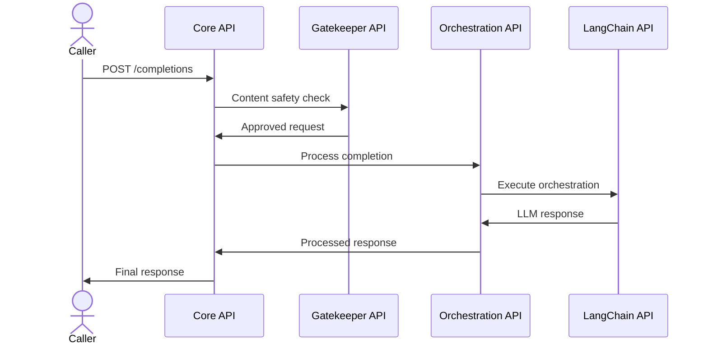

# Directly Calling the Core API

This guide explains how to call the FoundationaLLM Core API directly using tools like Postman, curl, or custom applications.

## Overview

While users typically interact with the Core API through the Chat User Portal, developers can call the API directly to:

- Integrate FoundationaLLM into custom applications
- Build automated workflows
- Test agent configurations
- Create custom chat interfaces

## API Architecture

The Core API is the entry point to FoundationaLLM's orchestration layer:



> **Note:** The Gatekeeper can be bypassed by setting `FoundationaLLM:APIs:CoreAPI:BypassGatekeeper` to `true` in App Configuration. This improves performance but disables content filtering.

## Prerequisites

Before calling the Core API, you need:

1. **Core API URL** - See [Finding Your Core API URL](finding-core-api-url.md)
2. **Instance ID** - Found in App Configuration: `FoundationaLLM:Instance:Id`
3. **Authentication Token** - Entra ID bearer token or Agent Access Token

## Using Postman

### Install Postman

Download and install [Postman](https://www.getpostman.com/).

### Import the Collection

Click the button below to fork and import the official FoundationaLLM Core API Postman collection:

[](https://app.getpostman.com/run-collection/269456-9ad62116-3057-4166-abfc-ece23923bff5?action=collection%2Ffork&source=rip_markdown&collection-url=entityId%3D269456-9ad62116-3057-4166-abfc-ece23923bff5%26entityType%3Dcollection%26workspaceId%3D0d6298a2-c3cd-4530-900c-030ed0ae6dfa)

### Configure Variables

1. Select the **FoundationaLLM.Core.API** collection
2. Click the **Variables** tab
3. Update the following **Current value** fields:

| Variable | Value | Where to Find |
|----------|-------|---------------|
| `baseUrl` | Your Core API URL | App Config: `FoundationaLLM:APIs:CoreAPI:APIUrl` |
| `instanceId` | Your instance GUID | App Config: `FoundationaLLM:Instance:Id` |
| `tenantId` | Azure AD tenant ID | Entra ID app registration |
| `appClientId` | Client ID | Entra ID app registration |
| `appScope` | API scope | Entra ID app registration |

4. Click **Save**

### Configure Authentication

1. Select the **Authorization** tab in the collection
2. Scroll to the bottom and click **Get New Access Token**
3. Log in with your credentials
4. Click **Use Token** after authentication
5. Click **Save**

> **Important:** Add `https://oauth.pstmn.io/v1/callback` as a Redirect URI in your Entra ID app registration for Postman authentication to work.

### Make Your First Request

1. Expand the **sessions** folder in the collection
2. Select the **GET Sessions** request
3. Click **Send**
4. Verify you receive a 200 OK response

## Using curl

### Get Authentication Token

First, obtain a bearer token using Azure CLI:

```bash
# Login to Azure
az login

# Get token for Core API
TOKEN=$(az account get-access-token \
  --resource api://{core-api-client-id} \
  --query accessToken -o tsv)
```

### List Sessions

```bash
curl -X GET \
  "https://{core-api-url}/instances/{instanceId}/sessions" \
  -H "Authorization: Bearer $TOKEN" \
  -H "Content-Type: application/json"
```

### Request a Completion

```bash
curl -X POST \
  "https://{core-api-url}/instances/{instanceId}/completions" \
  -H "Authorization: Bearer $TOKEN" \
  -H "Content-Type: application/json" \
  -d '{
    "user_prompt": "What is FoundationaLLM?",
    "agent_name": "default-agent"
  }'
```

### Create a Session

```bash
curl -X POST \
  "https://{core-api-url}/instances/{instanceId}/sessions" \
  -H "Authorization: Bearer $TOKEN" \
  -H "Content-Type: application/json" \
  -d '{
    "name": "My New Conversation"
  }'
```

### Completion with Session Context

```bash
curl -X POST \
  "https://{core-api-url}/instances/{instanceId}/completions" \
  -H "Authorization: Bearer $TOKEN" \
  -H "Content-Type: application/json" \
  -d '{
    "user_prompt": "Tell me more about that",
    "session_id": "{session-id}",
    "agent_name": "default-agent"
  }'
```

## Using Agent Access Tokens

For unauthenticated access scenarios, use Agent Access Tokens:

```bash
curl -X POST \
  "https://{core-api-url}/instances/{instanceId}/completions" \
  -H "X-AGENT-ACCESS-TOKEN: {agent-access-token}" \
  -H "Content-Type: application/json" \
  -d '{
    "user_prompt": "Hello, what can you do?"
  }'
```

See [Agent Access Tokens](../../../management-portal/reference/concepts/agent-access-tokens.md) for setup instructions.

## Swagger UI

For interactive API exploration:

| Deployment | Swagger URL |
|------------|-------------|
| ACA | `https://{core-api-url}/swagger/` |
| AKS | `https://{aks-url}/core/swagger/v1/swagger.json` |

## Common Request Patterns

### Sessionless Completion (Quick Query)

No conversation history:

```json
{
  "user_prompt": "What time is it in Tokyo?"
}
```

### Session-based Completion (Conversation)

Maintains context:

```json
{
  "user_prompt": "What about in London?",
  "session_id": "existing-session-id"
}
```

### Completion with Parameter Overrides

Customize model behavior:

```json
{
  "user_prompt": "Write a creative story",
  "settings": {
    "model_parameters": {
      "temperature": 0.9,
      "max_new_tokens": 2000
    }
  }
}
```

### Completion with Agent Selection

Target a specific agent:

```json
{
  "user_prompt": "Analyze this data",
  "agent_name": "data-analysis-agent"
}
```

## Error Handling

| Status | Meaning | Action |
|--------|---------|--------|
| 400 | Invalid request | Check request body format |
| 401 | Unauthorized | Refresh authentication token |
| 403 | Forbidden | Check user permissions |
| 404 | Not found | Verify endpoint URL and IDs |
| 429 | Rate limited | Wait and retry |
| 500 | Server error | Check API logs |

## Related Topics

- [Core API Overview](index.md)
- [API Reference](api-reference.md)
- [Finding Your Core API URL](finding-core-api-url.md)
- [.NET SDK](../../sdks/dotnet/index.md)
