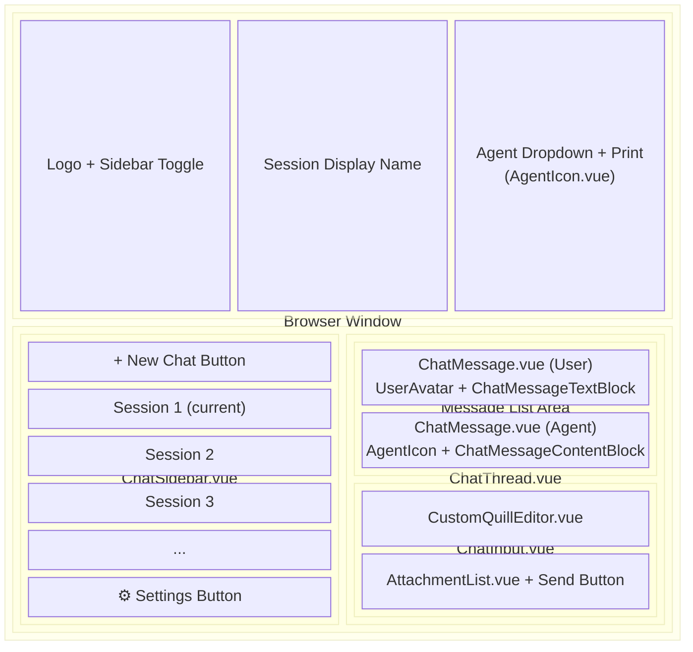
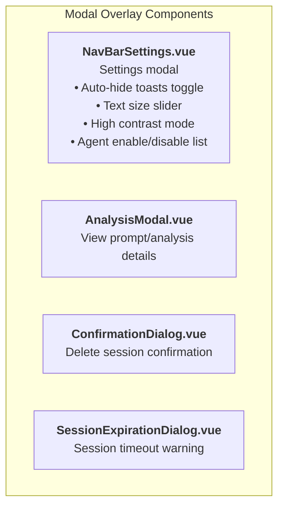
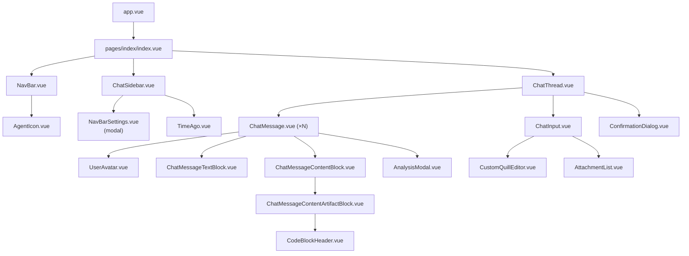

# UserPortal Component Architecture

This document describes the Vue.js component structure of the FoundationaLLM UserPortal and their screen coverage.

## Screen Layout Diagram

## Modal Overlays

These components render as modal dialogs on top of the main UI:

## Component Hierarchy

## Component Responsibilities

| Component | Screen Area | Purpose |
|-----------|-------------|---------|
| **NavBar.vue** | Top bar (fixed) | Logo, sidebar toggle, session name, agent dropdown, print |
| **ChatSidebar.vue** | Left panel (collapsible) | Session list, new chat, settings, session management |
| **ChatThread.vue** | Main content area | Message display, welcome message, loading states |
| **ChatMessage.vue** | Message bubbles | Individual message rendering (user or agent) |
| **ChatInput.vue** | Bottom of main area | Text input, attachments, send button |
| **NavBarSettings.vue** | Modal overlay | User preferences, agent toggles |
| **ConfirmationDialog.vue** | Modal overlay | Delete confirmations |

## File Locations

All components are located in `src/ui/UserPortal/components/`:

- `AgentIcon.vue`
- `AnalysisModal.vue`
- `AttachmentList.vue`
- `ChatInput.vue`
- `ChatMessage.vue`
- `ChatMessageContentArtifactBlock.vue`
- `ChatMessageContentBlock.vue`
- `ChatMessageTextBlock.vue`
- `ChatSidebar.vue`
- `ChatThread.vue`
- `CodeBlockHeader.vue`
- `ConfirmationDialog.vue`
- `CustomQuillEditor.vue`
- `NavBar.vue`
- `NavBarSettings.vue`
- `SessionExpirationDialog.vue`
- `TimeAgo.vue`
- `UserAvatar.vue`

## State Management

The UserPortal uses Pinia stores located in `src/ui/UserPortal/stores/`:

| Store | Purpose |
|-------|---------|
| **appStore.ts** | Sessions, messages, agents, attachments, user preferences |
| **appConfigStore.ts** | Application configuration (logo, featured agents, kiosk mode) |
| **authStore.ts** | Authentication state and user account |
| **confirmationStore.ts** | Confirmation dialog state |
