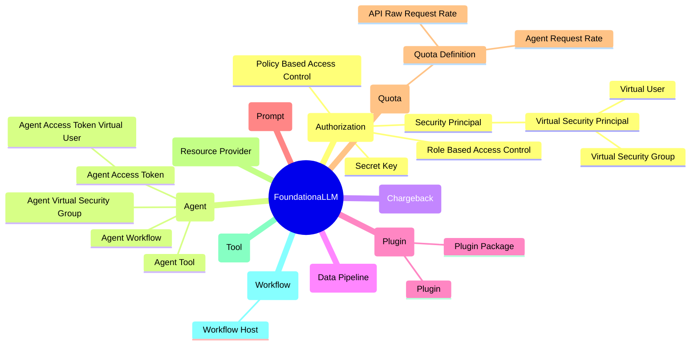

# Architecture & Core Concepts

This page provides a high-level overview of the core FoundationaLLM architecture and concepts.

## Core Concepts Overview

The following mindmap provides a high-level overview of the core FoundationaLLM concepts.

## Key Concepts

### Authorization & Security Principals

FoundationaLLM uses a comprehensive authorization model that includes:

- **Secret Key:** Unique strings for agent authentication
- **Role Based Access Control (RBAC):** Access restriction based on user roles
- **Policy Based Access Control (PBAC):** Access restriction based on policies
- **Security Principals:** Entities that can be authenticated (users, groups, service identities)
- **Virtual Security Principals:** Dynamically created principals for agents and access tokens

### Agents, Workflows, and Tools

- **Agent:** The core interaction unit that provides users with customized experiences
- **Agent Workflow:** Drives core agent interactions with associated tools
- **Agent Tool:** Tools associated with agents for executing code, interacting with APIs, or processing data
- **Agent Access Token:** Enables agent authentication without Entra ID credentials

### Data Pipelines

Data pipelines define processes for extracting, transforming, and loading data for LLM-based workloads. Key features include:
- Scalability for enterprise workloads
- Flexible and modular structure
- Local and global processing support
- Runtime parameterization
- Extensibility through plugins

### Plugins & Plugin Packages

Plugins extend FoundationaLLM functionality:
- **Plugin Package:** Unit of versioning and deployment for plugins
- **Plugin Types:** Agent Workflow, Agent Tool, Data Source, Data Pipeline Stage, Content Text Extraction, Content Text Partitioning

### Prompts & Prompt Variables

Prompts are text templates for creating agent completion requests, used in:
- Agent Workflows (for tool invocation decisions)
- Agent Tools (for additional context and instructions)

### Quotas

Quotas define resource usage limits:
- **API Raw Request Rate:** Maximum API requests per time period
- **Agent Request Rate:** Maximum agent completion calls per time period

### Resource Providers

Platform components managing resources like agents, prompts, data sources, and pipelines.

### Chargeback

Mechanism for tracking and billing resource usage by cost center-enabled entities.

---

For detailed information on each concept, see the [Concepts Reference](../concepts/index.md).
