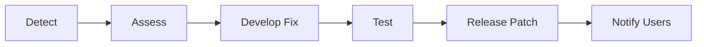

# Vulnerability Management

FoundationaLLM maintains a proactive approach to identifying, categorizing, and remediating security vulnerabilities.

## Vulnerability Identification

### Regular Security Testing

| Activity | Frequency | Purpose |
|----------|-----------|---------|
| **Red Team Exercises** | Periodic | Identify attack vectors |
| **Container Scans** | Every build | Detect CVEs |
| **Dependency Analysis** | Continuous | Track vulnerable packages |
| **Penetration Testing** | Periodic | External assessment |

### Automated Scanning

Every container image build includes:
- Base image vulnerability scanning
- Dependency analysis
- CVE detection
- Security best practice checks

## Severity Classification

### Severity Levels

| Level | Description | Response Time |
|-------|-------------|---------------|
| **Critical** | Severe, imminent threat | Immediate (hours) |
| **High** | Significant risk | 24-48 hours |
| **Major** | Moderate risk | 1 week |
| **Minor** | Low/negligible risk | Next release cycle |

### Classification Criteria

**Critical:**
- Remote code execution
- Authentication bypass
- Data exfiltration potential
- Active exploitation in the wild

**High:**
- Privilege escalation
- Significant data exposure
- Denial of service
- Requires immediate patching

**Major:**
- Limited impact vulnerabilities
- Complex exploitation requirements
- Defense-in-depth failures
- Scheduled remediation

**Minor:**
- Information disclosure (low impact)
- Configuration issues
- Best practice deviations
- Addressed in routine maintenance

## Remediation Process

### Critical/High Severity

1. **Detection** - Automated or reported
2. **Assessment** - Verify and classify
3. **Development** - Create fix
4. **Testing** - Validate fix
5. **Release** - Deploy patch
6. **Notification** - Inform users

### Standard Remediation

- Included in regular release cycles
- Documented in release notes
- Users upgrade at their schedule

## Communication

### GitHub Releases

Primary channel for security updates:

| Information | Location |
|-------------|----------|
| Security patches | Release notes |
| Vulnerability details | Security advisories |
| Upgrade instructions | Release documentation |
| Breaking changes | Migration guides |

### Release Notes Include

- Summary of vulnerabilities addressed
- Severity classification
- Affected versions
- Upgrade instructions
- Credit to reporters

### Responsible Disclosure

We practice responsible disclosure:
- Credit researchers who report vulnerabilities
- Coordinate disclosure timing
- Provide details after patch availability
- Document in security advisories

## Reporting Vulnerabilities

### How to Report

1. **Email:** security@foundationallm.ai
2. **GitHub:** Security advisories (private)
3. **Do not** disclose publicly before coordinated response

### Report Contents

Please include:
- Description of the vulnerability
- Steps to reproduce
- Potential impact
- Suggested remediation (if any)
- Your contact information

### Response Timeline

| Action | Timeline |
|--------|----------|
| Acknowledge receipt | 24-48 hours |
| Initial assessment | 1 week |
| Status update | Weekly |
| Patch development | Based on severity |
| Coordinated disclosure | After patch available |

## Staying Updated

### Subscribe to Updates

- Watch [GitHub repository](https://github.com/foundationallm/foundationallm)
- Enable release notifications
- Monitor security advisories

### Version Management

- Track deployed versions
- Plan regular update cycles
- Prioritize security patches

## Customer Responsibilities

### Recommended Practices

| Practice | Description |
|----------|-------------|
| **Stay Current** | Apply updates promptly |
| **Monitor Releases** | Watch for security patches |
| **Test Updates** | Verify in staging first |
| **Report Issues** | Help improve security |

### Update Checklist

- [ ] Review release notes
- [ ] Identify security fixes
- [ ] Plan update window
- [ ] Test in staging
- [ ] Deploy to production
- [ ] Verify functionality

## Related Topics

- [Platform Security](platform-security.md)
- [Updating Container Versions](../how-to-guides/updating-container-versions.md)
- [Creating Release Notes](../how-to-guides/creating-release-notes.md)
- [GitHub Releases](https://github.com/foundationallm/foundationallm/releases)
