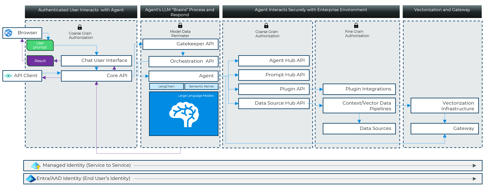
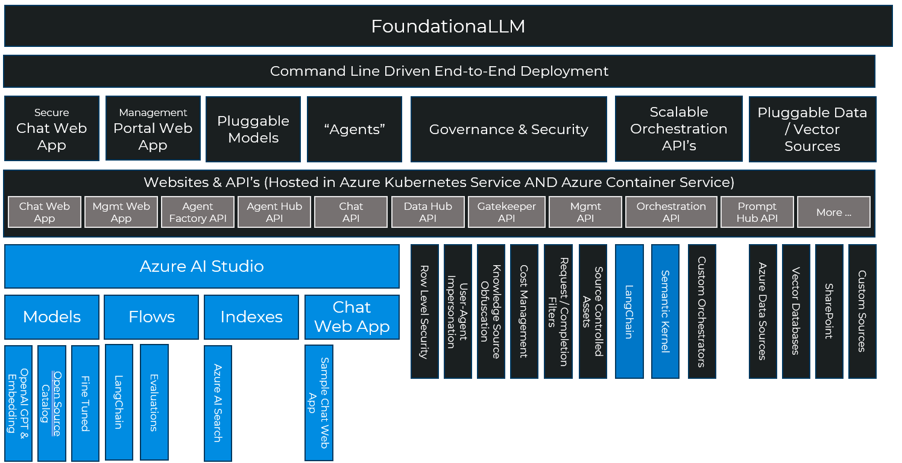
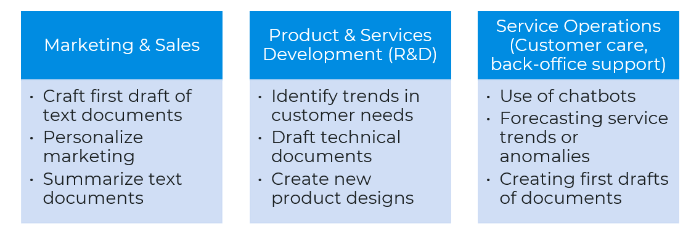

# Foundationa**LLM**: A platform accelerating delivery of secure, trustworthy enterprise copilots

Foundationa**LLM** simplifies and streamlines building *knowledge management* (e.g., question/answer agents) and *analytic* (e.g., self-service business intelligence) copilots over the data sources present across your enterprise.  

Foundationa**LLM** deploys a secure, comprehensive and highly configurable copilot platform to your Azure cloud environment:

- Simplifies integration with enterprise data sources used by agent for in-context learning (e.g., enabling RAG, CoT, ReAct and inner monologue patterns).
- Provides defense in depth with fine-grain security controls over data used by agent and pre/post completion filters that guard against attack.
- Hardened solution attacked by an LLM red team from inception.
- Scalable solution load balances across multiple LLM endpoints.
- Extensible to new data sources, new LLM orchestrators and LLMs.

### Reality
What it really takes to create a secure, well governed, scalable and extensible enterprise copilot solution:

#### Where does FoundationaLLM stack against the other copilot solutions?

## What do WE mean by "copilot"

It's a rapidly evolving AI world out there, so let's level set on what we mean when we say **copilot** as this is concept core to Foundationa**LLM**.

At its most basic, a copilot uses enterprise supplied knowledge and generative AI models to author text, write code or render images, often by reasoning over human supplied prompts. Across these modalities, the AI is used to assist a human directly with a specific task. That's what makes it a copilot.

This basic capability emerges in copilots which power these scenarios:

- Knowledge Management: Help users quickly find the information they seek and deliver at the right level and in the right format. Examples include summarization, rephrasing or retargeting to address a persona (e.g., explain it like I'm five), sentiment analysis and recommendations.
- Analytics: Help users quickly get to the data driven insights they seek. Examples include recommendations, predictions, anomaly detection, statistical analysis and data querying and reporting.

## Why is Foundationa**LLM** Needed?

Simply put we saw lot of folks reinventing the wheel just to get a customized copilot that was grounded and bases its responses in their own data as opposed to the trained parametric knowledge of the model. Many of the solutions we saw made for great demos, but were effectively toys wrapping calls to OpenAI endpoints- they were not something intended or ready to take into production. We built Foundationa**LLM** to provide a continous journey, one that was quick to get started with so folks could experiment quickly with LLM's but not fall off a cliff after that with a solution that would be insecure, unlicensed, inflexible and not fully featured enough to grow from the prototype into a production solution without having to start all over.  

The core problems to deliver enterprise copilots are:

- Enterprise grade copilots are complex and have lots of moving parts (not to mention infrastructure).
- The industry has a skills gap when it comes to filling the roles needed to deliver these complex copilot solutions.
- The top AI risks (inaccuracy, cybersecurity, compliance, explainability, privacy) are not being mitigated.
- Delivery of a copilot solution is time consuming, expensive and frustrating.

## Where can Foundationa**LLM** fill the need?

## Documentation

Get up to speed with Foundationa**LLM** by reading the [documentation](https://docs.foundationallm.ai). This includes deployment instructions, quickstarts, architecture, and API references.

## Getting Started

FoundationalLLM provides a simple command line driven approach to getting your first deployment up and running. Basically, it's two commands. After that, you can customize the solution, run it locally on your machine and update the deployment with your customizations.

Follow the [Quick Start Deployment instructions](./deployment/deployment-quick-start.md) to get Foundationa**LLM** deployed in your Azure subscription.

If you want to run the solution locally, follow the [Local Development instructions](development/development-local.md).

You can browse the documentation using the sidebar or visit the [API section](api/index.md) for the reference documentation.
