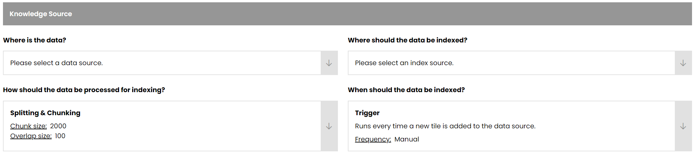
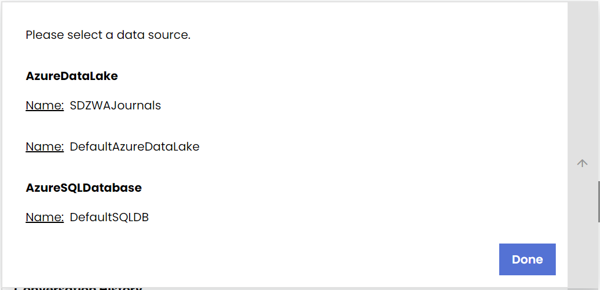

# Create a New Agent

This guide walks you through creating a new agent using the Management Portal.

## Prerequisites

- Access to the FoundationaLLM Management Portal
- Appropriate permissions to create agents

## Steps to Create a New Agent

### 1. Navigate to Create New Agent

Navigate to the **Create New Agent** page using the side navigation bar.
    

### 2. Select Agent Type

Set the agent type: **Knowledge Management** or **Analytics**. FoundationaLLM currently only supports Knowledge Management agents.

### 3. Configure Knowledge Source

Set the agent Knowledge Source:

- Expand the dropdown arrow next to the upper left box. Select the correct Content Source Profile.

    

- Expand the dropdown arrow next to the upper right box to open the Indexing Profile dropdown. Select the correct Indexing Profile.

    
 
- Expand the dropdown arrow next to the lower left box. Set the **Chunk size** and **Overlap size** settings for text partitioning. Select **Done**.

    

- Expand the dropdown arrow next to the lower right box. Set the trigger **Frequency**; FoundationaLLM currently only supports Manual triggers.

    

### 4. Configure User-Agent Interactions

Configure user-agent interactions.

- Enable conversation history using the `Yes/No` Radio Button. Select **Done**.

    

- Configure the Gatekeeper. Then, select **Done**.
    - `Enable/Disable` the Gatekeeper using the Radio Button
    - Set the **Content Safety** platform to either `None` or `Azure Content Safety` using the dropdown menu
    - Set the **Data Protection** platform to either `None` or `Microsoft Presidio` using the dropdown menu

    

### 5. Set the System Prompt

Set the **System Prompt**. The prompt prefixes users' requests to the agent, influencing the tone and functionality of the agent.

### 6. Create the Agent

After setting the desired agent configuration, select **Create Agent** at the bottom right-hand corner of the page. You will be able to edit the agent configuration after creation from the **Public Agents** page.

## Next Steps

- [Create Model Agnostic Agent with Claude](create-model-agnostic-agent-claude.md)
- [Create Model Agnostic Agent with GPT-4o](create-model-agnostic-agent-gpt4o.md)
- [Agents & Workflows Reference](../../reference/concepts/agents-workflows.md)
