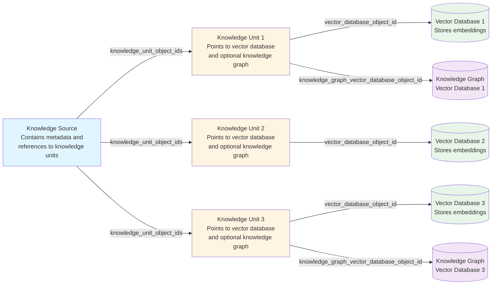
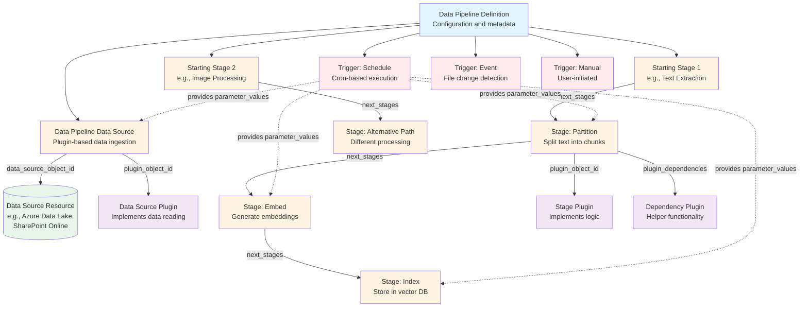
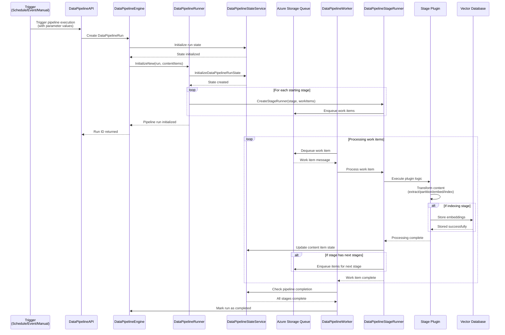
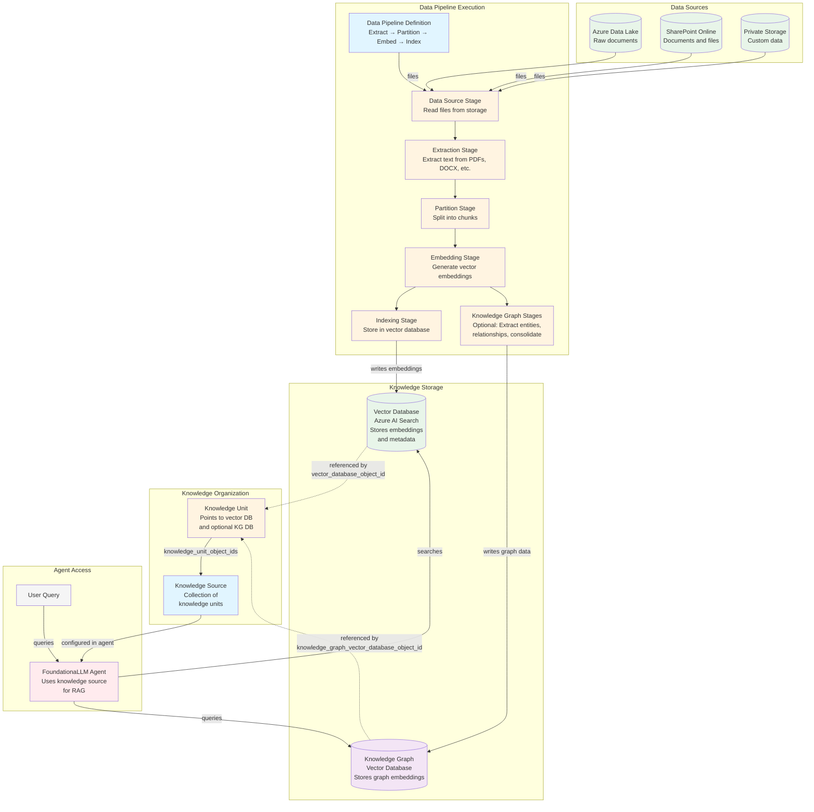
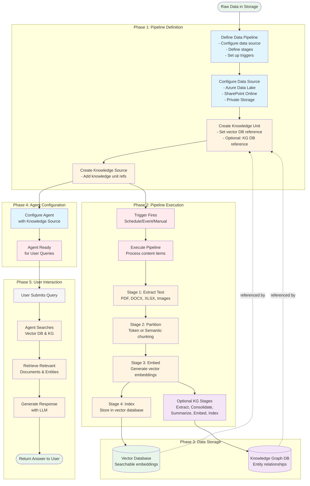

# Data Pipeline Concepts

This document provides visual representations of the core concepts related to data pipelines, knowledge sources, and knowledge units in FoundationaLLM.

## Knowledge Source and Knowledge Unit Relationship

A Knowledge Source represents a collection of related data, while Knowledge Units are the actual indexed data that can be queried. Each Knowledge Source can have multiple Knowledge Units associated with it.

**Key Points:**
- Each Knowledge Source contains a list of `knowledge_unit_object_ids` referencing its Knowledge Units
- Each Knowledge Unit has a required `vector_database_object_id` pointing to a vector database for semantic search
- Each Knowledge Unit can optionally have a `knowledge_graph_vector_database_object_id` for graph-based queries
- Knowledge Units also have an optional `vector_store_id` within the vector database

## Data Pipeline Structure

A Data Pipeline consists of three main components: Data Source, Stages (structured as a forest), and Triggers.

**Key Points:**
- **Data Source**: References a FoundationaLLM DataSource resource and uses a plugin to read data
- **Stages**: Organized as a forest (multiple starting points), each stage has a plugin and optional dependencies
- **Triggers**: Schedule, Event, or Manual triggers that provide parameter values to execute the pipeline
- **Plugins**: Both data sources and stages use plugins for implementation, with configurable parameters

## Data Pipeline Execution Flow

This diagram shows the lifecycle of a data pipeline execution from trigger to completion.

**Key Points:**
- Triggers initiate pipeline runs with parameter values
- Engine creates a DataPipelineRun and initializes state
- Runner creates stage runners for starting stages
- Work items are enqueued to Azure Storage Queues
- Workers dequeue and process items through stage plugins
- State service tracks progress of content items through stages
- Upon completion, items may be enqueued for subsequent stages
- Pipeline completes when all stages have processed all items

## Data Pipeline and Knowledge Unit Integration

This diagram shows how data pipelines populate knowledge units that are referenced by knowledge sources.

**Key Points:**
- Data pipelines read from various data sources (Azure Data Lake, SharePoint, etc.)
- Pipeline stages transform data: Extract → Partition → Embed → Index
- Optional knowledge graph stages can extract entities and relationships
- Embeddings are stored in vector databases (e.g., Azure AI Search)
- Knowledge graph data is stored in separate graph vector databases
- Knowledge Units reference the vector databases where data is stored
- Knowledge Sources aggregate multiple Knowledge Units
- Agents use Knowledge Sources for Retrieval-Augmented Generation (RAG)
- Users query agents, which in turn search the vector databases

## Complete End-to-End Flow

This diagram provides a comprehensive view of how data flows from source systems to user queries.

**Complete Flow Summary:**

1. **Phase 1: Setup & Definition**
   - Define data pipeline with stages and triggers
   - Configure data source connections
   - Create knowledge units pointing to target databases
   - Create knowledge sources aggregating knowledge units

2. **Phase 2: Data Processing**
   - Pipeline trigger fires (schedule, event, or manual)
   - Content items flow through stages: Extract → Partition → Embed → Index
   - Optional knowledge graph stages extract entities and relationships
   - Each stage transforms data and passes to next stage

3. **Phase 3: Persistent Storage**
   - Vector embeddings stored in vector databases (Azure AI Search)
   - Knowledge graph data stored in graph databases
   - Knowledge units reference these storage locations

4. **Phase 4: Agent Setup**
   - Agents configured with knowledge sources
   - Knowledge sources provide access to all associated knowledge units
   - Agent ready to serve user queries

5. **Phase 5: Query & Response**
   - User submits natural language query
   - Agent searches vector databases and knowledge graphs
   - Relevant documents and entities retrieved
   - LLM generates contextual response using retrieved information
   - Response returned to user

## Key Concepts Summary

| Concept | Description | Purpose |
|---------|-------------|---------|
| **Knowledge Source** | Collection of knowledge units | Aggregates multiple knowledge units for agent use |
| **Knowledge Unit** | References to indexed data | Points to vector DB and optional knowledge graph |
| **Data Pipeline** | Automated data processing workflow | Transforms raw data into searchable knowledge |
| **Data Source** | Source of raw data | Provides input files/documents for processing |
| **Pipeline Stage** | Single processing step | Performs specific transformation (extract, partition, embed, index) |
| **Pipeline Trigger** | Execution initiator | Starts pipeline on schedule, event, or manual action |
| **Plugin** | Pluggable implementation | Provides specific functionality for data sources and stages |
| **Vector Database** | Embedding storage | Enables semantic search over processed data |
| **Knowledge Graph** | Entity relationship storage | Enables graph-based queries and reasoning |

## Parameter Naming Convention

When triggers provide parameter values to execute pipelines, they follow a specific naming convention:

- **Data Source Parameters**: `DataSource.{DataSourceName}.{ParameterName}`
  - Example: `DataSource.VGDataLake.Folders`

- **Stage Parameters**: `Stage.{StageName}.{ParameterName}`
  - Example: `Stage.Partition.PartitioningStrategy`

- **Stage Dependency Parameters**: `Stage.{StageName}.Dependency.{DependencyPluginName}.{ParameterName}`
  - Example: `Stage.Partition.Dependency.TokenContentTextPartitioning.PartitionSizeTokens`

This convention allows triggers to provide all necessary configuration values for pipeline execution without user interaction.

## Related Documentation

- [Data Pipelines Reference](../docs/management-portal/reference/concepts/data-pipelines.md)
- [Creating Data Pipelines](../docs/management-portal/how-to-guides/data/data-pipelines/creating-data-pipelines.md)
- [Knowledge Graph Integration](../docs/management-portal/how-to-guides/data/knowledge-sources/knowledge-graph-integration.md)
- [Plugin Documentation](../docs/concepts/plugin/plugin.md)
