# FoundationaLLM Network Architecture

This document provides a visual overview of the FoundationaLLM network architecture when deployed to Azure using Azure Container Apps.

## Network Diagram

```mermaid
flowchart TB
    subgraph Internet["🌐 Internet"]
        Dev1["💻 Developer Laptop 1<br/>Home Network"]
        Dev2["💻 Developer Laptop 2<br/>Office Network"]
        Users["👥 End Users"]
        Admins["👔 Administrators"]
    end

    subgraph GitHub["☁️ GitHub Cloud"]
        Repo["📦 foundationallm/foundationallm"]
        GHCR["📦 GitHub Container Registry<br/>ghcr.io/foundationallm"]
    end

    subgraph Azure["☁️ Azure Region (e.g., East US 2)"]
        
        subgraph PublicEndpoints["🔓 Public Endpoints (HTTPS 443)"]
            UserPortalIP["🌐 user-portal<br/>*.azurecontainerapps.io"]
            MgmtPortalIP["🌐 management-portal<br/>*.azurecontainerapps.io"]
        end

        subgraph VNet["🔒 Virtual Network (10.0.0.0/16)"]
            
            subgraph CAESubnet["📡 Container Apps Subnet (10.0.0.0/21)"]
                subgraph CAE["🐳 Container Apps Environment"]
                    
                    subgraph FrontendApps["Frontend (External Ingress)"]
                        UserPortal["👤 user-portal:80"]
                        MgmtPortal["📋 management-portal:80"]
                    end
                    
                    subgraph BackendAPIs["Backend APIs (Internal Ingress)"]
                        CoreAPI["🚀 core-api:80"]
                        MgmtAPI["📋 management-api:80"]
                        AuthAPI["🔐 authorization-api:80"]
                        OrchAPI["🎭 orchestration-api:80"]
                        GatewayAPI["🚪 gateway-api:80"]
                        LangChainAPI["🔗 langchain-api:80"]
                        StateAPI["💾 state-api:80"]
                        ContextAPI["📝 context-api:80"]
                        CoreWorker["⚡ core-worker"]
                    end
                end
            end
            
            subgraph PESubnet["🔐 Private Endpoints Subnet (10.0.8.0/24)"]
                PE_KV["PE: Key Vault"]
                PE_Storage["PE: Storage"]
                PE_Cosmos["PE: Cosmos DB"]
                PE_AppConfig["PE: App Config"]
                PE_AI["PE: AI Services"]
            end
        end

        subgraph PaaS["☁️ Azure PaaS Services"]
            subgraph CoreRG["Core Resource Group"]
                KV["🔑 Key Vault"]
                AppConfig["⚙️ App Configuration"]
                AppInsights["📊 App Insights"]
                EventGrid["📨 Event Grid"]
            end
            
            subgraph DataRG["Data Resource Group"]
                Storage["📦 Blob Storage<br/>(ADLS Gen2)"]
                CosmosDB["🌍 Cosmos DB"]
            end
            
            subgraph ContextRG["Context Resource Group"]
                ContextStorage["📦 Context Storage"]
            end
            
            subgraph AIRG["AI Resource Group"]
                AIServices["🤖 AI Services<br/>(OpenAI Endpoint)"]
            end
        end

        subgraph EntraID["🔷 Microsoft Entra ID"]
            OAuth["OAuth 2.0 / OIDC<br/>Token Validation"]
        end
    end

    %% Developer connections
    Dev1 -->|"HTTPS 443<br/>git push"| Repo
    Dev2 -->|"HTTPS 443<br/>git push"| Repo
    Repo -->|"Build & Push<br/>Images"| GHCR
    GHCR -->|"Pull Images<br/>HTTPS 443"| CAE

    %% User traffic flow
    Users -->|"HTTPS 443"| UserPortalIP
    Admins -->|"HTTPS 443"| MgmtPortalIP
    UserPortalIP --> UserPortal
    MgmtPortalIP --> MgmtPortal

    %% Internal API calls (within CAE - internal DNS)
    UserPortal -->|"HTTP 80"| CoreAPI
    MgmtPortal -->|"HTTP 80"| MgmtAPI
    CoreAPI -->|"HTTP 80"| AuthAPI
    CoreAPI -->|"HTTP 80"| OrchAPI
    MgmtAPI -->|"HTTP 80"| AuthAPI
    OrchAPI -->|"HTTP 80"| LangChainAPI
    LangChainAPI -->|"HTTP 80"| GatewayAPI
    CoreAPI -->|"HTTP 80"| StateAPI
    CoreAPI -->|"HTTP 80"| ContextAPI

    %% Private endpoint connections
    PE_KV -.->|"Private Link"| KV
    PE_Storage -.->|"Private Link"| Storage
    PE_Cosmos -.->|"Private Link"| CosmosDB
    PE_AppConfig -.->|"Private Link"| AppConfig
    PE_AI -.->|"Private Link"| AIServices

    %% Service to PaaS via Private Endpoints
    BackendAPIs -->|"TCP 443"| PE_KV
    BackendAPIs -->|"TCP 443"| PE_AppConfig
    BackendAPIs -->|"TCP 443"| PE_Storage
    BackendAPIs -->|"TCP 443"| PE_Cosmos
    GatewayAPI -->|"TCP 443"| PE_AI
    ContextAPI -->|"TCP 443"| ContextStorage

    %% Telemetry (outbound)
    CAE -.->|"HTTPS 443<br/>Telemetry"| AppInsights
    CAE -.->|"HTTPS 443<br/>Events"| EventGrid

    %% Auth flow
    FrontendApps -.->|"HTTPS 443<br/>Token Validation"| OAuth
    BackendAPIs -.->|"HTTPS 443<br/>Token Validation"| OAuth

    %% Styling
    classDef internet fill:#E8E8E8,stroke:#999,color:#333
    classDef github fill:#24292E,stroke:#1B1F23,color:#fff
    classDef public fill:#28A745,stroke:#1E7E34,color:#fff
    classDef vnet fill:#0078D4,stroke:#005A9E,color:#fff
    classDef container fill:#326CE5,stroke:#1E4F9E,color:#fff
    classDef privateendpoint fill:#FF6B6B,stroke:#CC5555,color:#fff
    classDef paas fill:#FF8C00,stroke:#CC7000,color:#fff
    classDef identity fill:#68217A,stroke:#4B1557,color:#fff

    class Dev1,Dev2,Users,Admins internet
    class Repo,GHCR github
    class UserPortalIP,MgmtPortalIP public
    class UserPortal,MgmtPortal,CoreAPI,MgmtAPI,AuthAPI,OrchAPI,GatewayAPI,LangChainAPI,StateAPI,ContextAPI,CoreWorker container
    class PE_KV,PE_Storage,PE_Cosmos,PE_AppConfig,PE_AI privateendpoint
    class KV,AppConfig,AppInsights,EventGrid,Storage,CosmosDB,ContextStorage,AIServices paas
    class OAuth identity
```

## Network Zones

| Zone | CIDR / Endpoint | Purpose |
|------|-----------------|---------|
| **Internet** | Public | Developers, End Users, GitHub |
| **Public Endpoints** | `*.azurecontainerapps.io` | User Portal, Management Portal (HTTPS 443) |
| **Container Apps Subnet** | `10.0.0.0/21` | All containerized microservices |
| **Private Endpoints Subnet** | `10.0.8.0/24` | Secure PaaS connectivity |

## Traffic Flows

| Flow | Protocol | Source → Destination |
|------|----------|---------------------|
| **User Access** | HTTPS 443 | Internet → Public Endpoints → Portals |
| **API Calls** | HTTP 80 | Container ↔ Container (internal) |
| **Data Access** | TCP 443 | Containers → Private Endpoints → PaaS |
| **AI Inference** | HTTPS 443 | gateway-api → AI Services |
| **Telemetry** | HTTPS 443 | All containers → App Insights |
| **Authentication** | HTTPS 443 | All services → Entra ID |
| **CI/CD** | HTTPS 443 | GitHub → GHCR → Container Apps |

## Security Boundaries

- **External ingress**: Only `user-portal` and `management-portal` are publicly accessible
- **Internal ingress**: All backend APIs use internal ingress (not publicly accessible)
- **Private Link**: All Azure PaaS services are accessed via private endpoints within the VNet
- **OAuth 2.0**: All requests are authenticated via Microsoft Entra ID

## Container Apps Services

### Frontend Services (External Ingress)

| Service | Description |
|---------|-------------|
| `user-portal` | End-user web application for interacting with AI agents |
| `management-portal` | Administrative web application for managing agents, prompts, and configuration |

### Backend APIs (Internal Ingress)

| Service | Description |
|---------|-------------|
| `core-api` | Main API gateway for user-facing operations |
| `management-api` | API for administrative operations |
| `authorization-api` | Handles authentication and authorization |
| `orchestration-api` | Routes requests to appropriate AI orchestrators |
| `gateway-api` | Gateway for AI model interactions |
| `langchain-api` | LangChain-based orchestration service |
| `state-api` | Manages conversation and application state |
| `context-api` | Handles context and file operations |
| `core-worker` | Background job processing |

## Azure PaaS Services

| Service | Resource Group | Purpose |
|---------|---------------|---------|
| **Key Vault** | Core | Secrets and certificate management |
| **App Configuration** | Core | Centralized application configuration |
| **Application Insights** | Core | Monitoring and telemetry |
| **Event Grid** | Core | Event-driven messaging |
| **Blob Storage (ADLS Gen2)** | Data | Resource provider storage, file storage |
| **Cosmos DB** | Data | Conversations, state, and document storage |
| **Context Storage** | Context | Context files and queue storage |
| **AI Services** | AI | Azure OpenAI endpoints for LLM inference |
