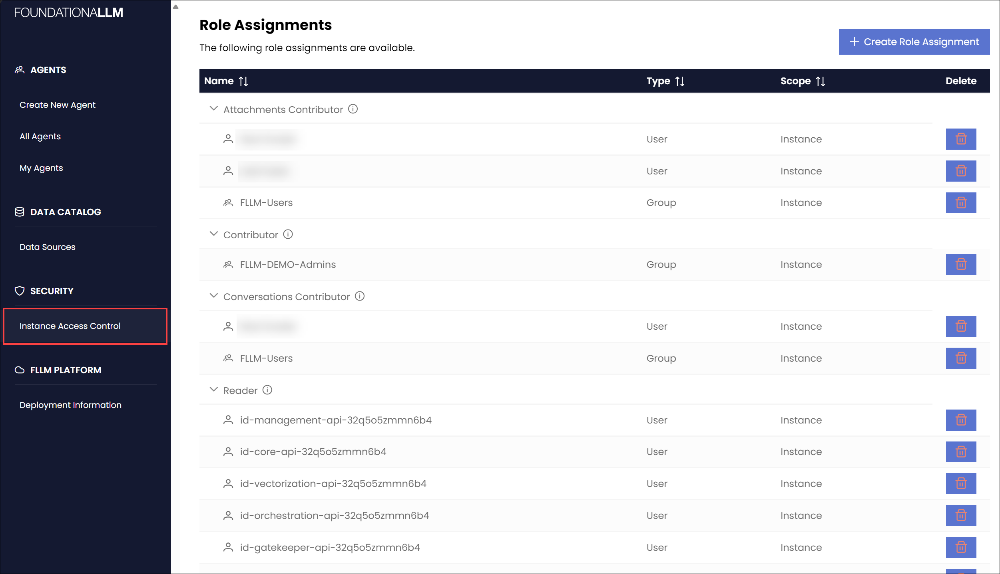
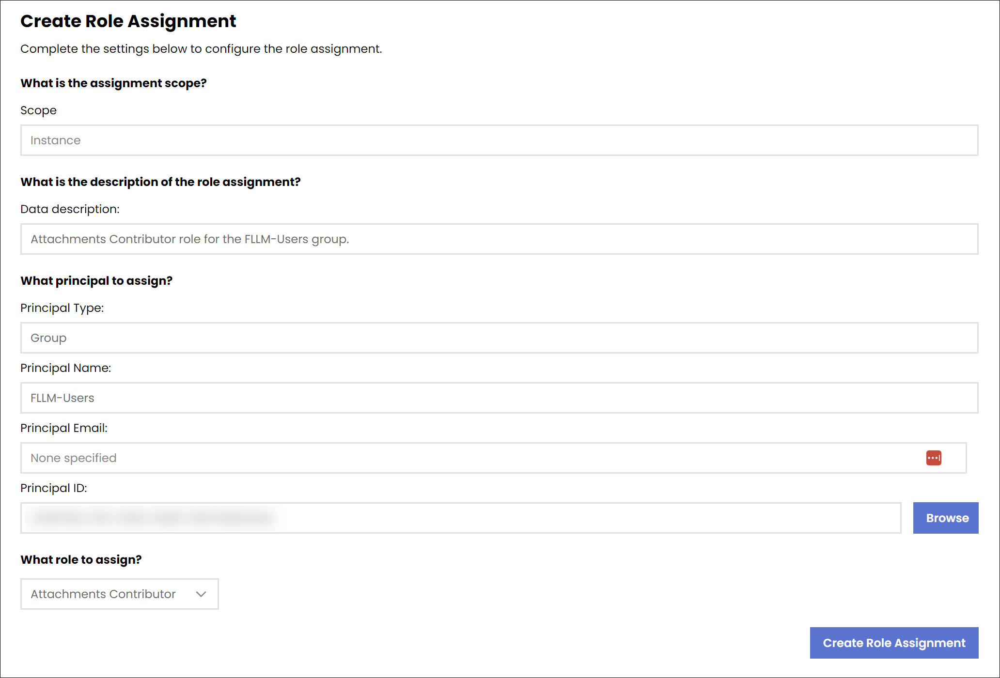
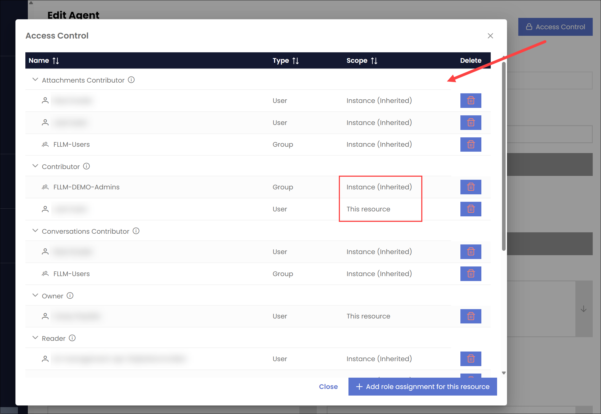

# Manage role assignments

FoundationaLLM roles are assigned to users, groups, service principals, and managed identities through the Management API. As described in the [role definitions](role-definitions.md) article, administrators can apply fine-grained access control to features and resources to ensure the deployment adheres to least-privilege best practices when properly assigned.

## Role management endpoints

The Management API provides the following role management endpoints:

| Method | Endpoint | Description |
| --- | --- | --- |
| GET | `/instances/{instanceId}/providers/FoundationaLLM.Authorization/roleDefinitions` | Returns a list of all role definitions. |
| POST | `/instances/{instanceId}/providers/FoundationaLLM.Authorization/roleAssignments/filter` | Returns the role assignments for a given scope. Here is a sample request payload for retrieving all RBAC role assignments for an FLLM instance: `{"scope":"/instances/aaaaaaaa-bbbb-cccc-dddd-eeeeeeeeeeee"}`. To retrieve the role assignments for a specific resource, set the request body to the resource's scope: `{"scope":"/instances/aaaaaaaa-bbbb-cccc-dddd-eeeeeeeeeeee/providers/FoundationaLLM.Agent/agents/FoundationaLLM"}` |
| POST | `/instances/{instanceId}/providers/FoundationaLLM.Authorization/roleAssignments/{roleAssignmentName}` | Creates a new role assignment. Here is an example request payload: `{"name":"55555555-4444-3333-2222-111111111111","description":"","principal_id":"11111111-2222-3333-4444-555555555555","role_definition_id":"/providers/FoundationaLLM.Authorization/roleDefinitions/a9f0020f-6e3a-49bf-8d1d-35fd53058edf","type":"FoundationaLLM.Authorization/roleAssignments","principal_type":"User","scope":"/instances/aaaaaaaa-bbbb-cccc-dddd-eeeeeeeeeeee/providers/FoundationaLLM.Agent/agents/FoundationaLLM"}` |
| DELETE | `/instances/{instanceId}/providers/FoundationaLLM.Authorization/roleAssignments/{roleAssignmentName}` | Deletes a role assignment. |

## Identity endpoints

The Management API provides the following identity endpoints:

| Method | Endpoint | Description |
| --- | --- | --- |
| POST | `/instances/{instanceId}/identity/users/retrieve` | Returns a list of user identities. Filter and page through the identities with the following request payload structure: `{"name":"","ids":[],"page_number":1,"page_size":null}` |
| POST | `/instances/{instanceId}/identity/groups/retrieve` | Returns a list of group identities. Filter and page through the identities with the following request payload structure: `{"name":"","ids":[],"page_number":1,"page_size":null}` |
| POST | `/instances/{instanceId}/identity/objects/retrievebyids` | Returns user and group objects by the passed in list of IDs. Here is a sample request payload: `{"ids":["11111111-2222-3333-4444-555555555555","66666666-7777-8888-9999-000000000000"]}` |

## Role assignment management

The Management Portal provides a graphical user interface over the Management API for managing roles and role assignments, among other FLLM configuration settings.

All role assignment changes are audited and can be viewed in the Management Portal. Auditing ensures that all changes to role assignments are tracked and can be reviewed at a later time, which is often required for compliance purposes.

The following screenshot shows the role assignment management page in the Management Portal for the FoundationaLLM instance:

The following screenshot shows the role assignment management form:

Use the **Browse** button to search for users, groups, service principals, and managed identities. Selecting a user, group, service principal, or managed identity will populate the **Principal Type**, **Principal Name**, **Principal Email**, and **Principal ID** fields with the selected identity's information.

### Assign access control to a specific resource

Most resources, such as Agents, provide an option to directly assign role-based access control to the resource. The following screenshot shows an **Access Control** button on top of a selected agent's form with the access control dialog displayed after selecting the button:

Note that the **Scope** column of the list of role assignments shows whether the role assignment is at the instance level or at the resource level. A value of `This resource` indicates a direct role assignment on the resource. When the value is `Instance (inherited)`, the role assignment is inherited from the instance level. This is similar to how Azure RBAC works.

## Role assignment data store

The role-based access control (RBAC) engine uses a dedicated data store to manage role assignments. Doing so ensures isolation from the rest of the FoundationaLLM data platform, which is used to store data sources, prompts, and other resources accessible to users possessing varying levels of access. The isolation also supports the ability to scale the RBAC engine independently from the rest of the FoundationaLLM data platform. The data store is implemented as a dedicated Azure Cosmos DB account or Azure Data Lake Storage Gen2 account.
