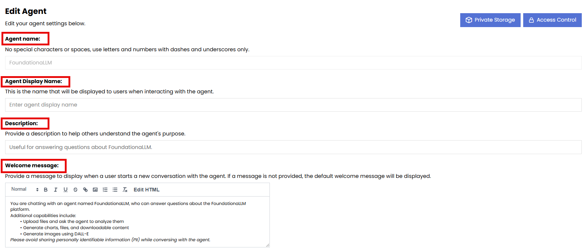
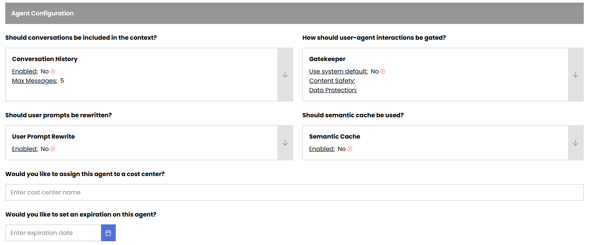

# Agents and Workflows

Foundationa**LLM** (FLLM) agents are the core of the solution. They are responsible for providing users with a customized experience based on its configuration.

## Creation of a new Agent

To create a new agent, you can use the **Create Agent** hyperlink in the **Agents** section of the **Management Portal**. 

### The creation of a new agent consists of 5 sections:

- General
- Agent Configuration
- Workflow
- Tools
- Security

### General Section

In this section, you can define the name, description and welcome message of the agent. The Welcome message is what a user will see in the Chat portal as soon as they pick that agent from the dropdown to learn about the agent and its services that it provides before starting a chat conversation.



---

## Agent Configuration Section

This section contains the core behavioral settings for your agent. Each configuration option affects how the agent interacts with users and processes requests.



### Conversation History

Conversation history enables the agent to maintain context across multiple exchanges within a session, allowing for more coherent and contextual responses.

#### Configuration Options

| Setting | Description | Default |
|---------|-------------|---------|
| **Enable Conversation History** | When enabled, the agent retains previous messages in the session | `true` |
| **Maximum History Messages** | Number of previous messages to include in context | `5` |

#### How It Works

When conversation history is enabled:

1. User messages and agent responses are stored in the session
2. Previous exchanges are included in the prompt context sent to the LLM
3. The agent can reference earlier parts of the conversation
4. Context window limits determine how much history can be effectively used

#### Use Cases

| Scenario | Recommendation |
|----------|----------------|
| **Q&A with follow-ups** | Enable with 5-10 messages |
| **Complex analysis** | Enable with higher message count |
| **Simple lookups** | Can disable for performance |
| **Privacy-sensitive** | Consider lower message count |

#### API Configuration

```json
{
  "conversation_history_settings": {
    "enabled": true,
    "max_history": 5
  }
}
```

#### Best Practices

1. **Balance context vs. cost**: More history means more tokens consumed
2. **Consider relevance decay**: Very old messages may not be useful
3. **Session boundaries**: History resets when a new session starts
4. **Privacy considerations**: Users should understand their messages are retained

---

### Gatekeeper

The Gatekeeper provides content moderation and safety controls for agent conversations. It acts as a filter between user input, agent responses, and the underlying LLM.

#### Gatekeeper Architecture

```
User Input --> Gatekeeper (Pre-processing) --> LLM --> Gatekeeper (Post-processing) --> User
                    |                                          |
                    v                                          v
              Content Safety                            Content Safety
              Data Protection                           Data Protection
              Prompt Shield                             Response Filtering
```

#### Configuration Options

| Setting | Description |
|---------|-------------|
| **Use System Setting** | Use instance-wide gatekeeper configuration |
| **Enable/Disable** | Turn gatekeeper on or off for this agent |
| **Content Safety Options** | Select which content safety providers to use |
| **Data Protection Options** | Select which data protection providers to use |

#### Enabling/Disabling the Gatekeeper

- **Enabled**: All configured safety checks are applied
- **Disabled**: No content filtering (not recommended for production)
- **Use System Setting**: Inherits from instance configuration

> [!WARNING]
> Disabling the Gatekeeper removes content protection. Only disable for testing or when you have alternative safety measures.

#### API Configuration

```json
{
  "gatekeeper_settings": {
    "use_system_setting": false,
    "options": [
      "ContentSafety",
      "Presidio"
    ]
  }
}
```

---

### Content Safety

Content Safety detects and filters harmful content in both user inputs and agent responses. Multiple providers are supported.

#### Supported Content Safety Providers

| Provider | Description | Features |
|----------|-------------|----------|
| **Azure Content Safety** | Microsoft's content moderation service | Hate, violence, self-harm, sexual content detection |
| **Azure Content Safety Prompt Shield** | Enhanced protection against prompt injection attacks | Jailbreak detection, prompt injection prevention |
| **Lakera Guard** | Third-party AI security platform | Prompt injection, PII detection, toxicity |
| **Enkrypt Guardrails** | Third-party content guardrails | Custom safety rules, content filtering |

#### Azure Content Safety Configuration

Azure Content Safety provides severity-based filtering for four categories:

| Category | Description | Severity Levels |
|----------|-------------|-----------------|
| **Hate** | Hateful or discriminatory content | 0-6 (0=safe, 6=severe) |
| **Violence** | Violent or threatening content | 0-6 |
| **Self-Harm** | Self-harm related content | 0-6 |
| **Sexual** | Sexual or adult content | 0-6 |

**Severity Threshold Configuration:**

```
FoundationaLLM:APIs:Gatekeeper:AzureContentSafety:HateSeverity = 2
FoundationaLLM:APIs:Gatekeeper:AzureContentSafety:ViolenceSeverity = 2
FoundationaLLM:APIs:Gatekeeper:AzureContentSafety:SelfHarmSeverity = 2
FoundationaLLM:APIs:Gatekeeper:AzureContentSafety:SexualSeverity = 2
```

Content at or above the threshold severity is blocked.

#### Azure Content Safety Prompt Shield

Prompt Shield provides additional protection against:

- **Jailbreak attempts**: Attempts to bypass system instructions
- **Prompt injection**: Malicious instructions embedded in user input
- **Indirect attacks**: Attacks via uploaded documents or external content

Enable via App Configuration:

```
FoundationaLLM:APIs:GatekeeperAPI:Configuration:EnableAzureContentSafetyPromptShield = true
```

#### Content Safety in the Management Portal

1. Navigate to your agent's **Agent Configuration** section
2. Locate the **Gatekeeper** settings
3. Set **Content Safety** to your preferred provider:
   - `None` - No content safety (not recommended)
   - `Azure Content Safety` - Microsoft's content moderation
   - Additional providers based on configuration


---

### Data Protection

Data Protection filters sensitive information like personally identifiable information (PII) from conversations, helping maintain compliance with privacy regulations.

#### Microsoft Presidio

FoundationaLLM uses **Microsoft Presidio** for data protection:

| Feature | Description |
|---------|-------------|
| **PII Detection** | Identifies personal information in text |
| **Entity Recognition** | Detects names, emails, phone numbers, SSNs, etc. |
| **Anonymization** | Can mask or redact sensitive data |
| **Customizable** | Supports custom entity types |

#### Supported Entity Types

| Entity | Examples |
|--------|----------|
| `PERSON` | Names of individuals |
| `EMAIL_ADDRESS` | Email addresses |
| `PHONE_NUMBER` | Phone numbers |
| `CREDIT_CARD` | Credit card numbers |
| `US_SSN` | US Social Security numbers |
| `IP_ADDRESS` | IP addresses |
| `LOCATION` | Geographic locations |

#### Configuring Data Protection

In the Management Portal:

1. Navigate to **Agent Configuration** > **Gatekeeper**
2. Set **Data Protection** to:
   - `None` - No data protection
   - `Microsoft Presidio` - Enable PII filtering

App Configuration setting:

```
FoundationaLLM:APIs:GatekeeperAPI:Configuration:EnableMicrosoftPresidio = true
```

#### Data Protection Behavior

When enabled, Presidio:

1. **Scans user input** for sensitive data before processing
2. **Scans agent responses** before returning to user
3. **Logs detections** for compliance auditing
4. **Can block or mask** depending on configuration

---

### Prompt Rewriting

Prompt Rewriting automatically refines user prompts before sending them to the LLM, improving response quality and consistency.

#### How Prompt Rewriting Works

```
Original User Prompt --> Rewrite Model --> Enhanced Prompt --> Main Model --> Response
```

1. User submits a question or request
2. A dedicated LLM rewrites the prompt for clarity and context
3. The enhanced prompt is sent to the main model
4. The main model generates the response

#### Benefits

| Benefit | Description |
|---------|-------------|
| **Improved clarity** | Vague prompts become more specific |
| **Context injection** | Adds relevant context automatically |
| **Consistency** | Standardizes prompt format |
| **Better retrieval** | Improves RAG query quality |

#### Configuration

Enable prompt rewriting in the agent configuration:

```json
{
  "user_prompt_rewrite_enabled": true,
  "user_prompt_rewrite_settings": {
    "user_prompt_rewrite_ai_model_object_id": "/instances/{instanceId}/providers/FoundationaLLM.AIModel/aiModels/GPT4oCompletionAIModel",
    "user_prompt_rewrite_prompt_object_id": "/instances/{instanceId}/providers/FoundationaLLM.Prompt/prompts/FoundationaLLM-Rewrite"
  }
}
```

| Setting | Description |
|---------|-------------|
| `user_prompt_rewrite_enabled` | Enable/disable prompt rewriting |
| `user_prompt_rewrite_ai_model_object_id` | Model used for rewriting |
| `user_prompt_rewrite_prompt_object_id` | Prompt template for rewriting |

#### Use Cases

| Scenario | Benefit |
|----------|---------|
| **RAG agents** | Better search queries |
| **Technical support** | Standardize question format |
| **Multi-language** | Normalize language variations |

<!-- [TODO: Add Management Portal UI documentation for prompt rewriting when available] -->

---

### Semantic Cache

Semantic Cache stores and retrieves responses based on the semantic similarity of prompts, reducing latency and costs for similar queries.

#### How Semantic Cache Works

```
User Prompt --> Embedding --> Cache Lookup --> Cache Hit? --> Return Cached Response
                                    |
                                    v (Cache Miss)
                              LLM Processing --> Cache Store --> Return Response
```

1. User prompt is converted to an embedding
2. Cache is searched for semantically similar prompts
3. If found (cache hit), cached response is returned immediately
4. If not found (cache miss), LLM processes the request and caches the result

#### Benefits

| Benefit | Impact |
|---------|--------|
| **Reduced latency** | Cached responses return instantly |
| **Cost savings** | Fewer LLM API calls |
| **Consistency** | Same questions get same answers |
| **Scalability** | Handle more concurrent users |

#### Configuration

Enable semantic cache in the agent configuration:

```json
{
  "semantic_cache_enabled": true,
  "semantic_cache_settings": {
    "similarity_threshold": 0.95,
    "cache_ttl_seconds": 3600
  }
}
```

| Setting | Description | Default |
|---------|-------------|---------|
| `semantic_cache_enabled` | Enable/disable semantic caching | `false` |
| `similarity_threshold` | How similar prompts must be (0.0-1.0) | `0.95` |
| `cache_ttl_seconds` | How long to keep cached responses | `3600` |

#### Considerations

| Consideration | Recommendation |
|---------------|----------------|
| **Dynamic content** | Lower TTL or disable for time-sensitive data |
| **Personalization** | May not be suitable for user-specific responses |
| **Similarity threshold** | Higher = fewer false positives, more cache misses |

<!-- [TODO: Add Management Portal UI documentation for semantic cache when available] -->

---

### Cost Center

Cost Center enables tracking and allocation of agent usage costs to specific departments, projects, or budget categories.

#### Purpose

- **Budget tracking**: Monitor costs per department or project
- **Chargeback**: Allocate AI costs to appropriate cost centers
- **Usage analysis**: Understand consumption patterns by business unit
- **Financial planning**: Forecast AI spending

#### Configuration

In the Management Portal:

1. Navigate to **Agent Configuration**
2. Enter the **Cost Center** identifier
3. Save the agent

API Configuration:

```json
{
  "cost_center": "DEPT-MARKETING-2025"
}
```

#### Cost Center Tracking

When configured, the following are tracked per cost center:

| Metric | Description |
|--------|-------------|
| **Token usage** | Input and output tokens consumed |
| **API calls** | Number of completion requests |
| **Processing time** | Total compute time |

#### Best Practices

1. **Consistent naming**: Use a standard format (e.g., `DEPT-NAME-YEAR`)
2. **Hierarchy support**: Consider nested identifiers (`ORG/DEPT/PROJECT`)
3. **Regular review**: Monitor cost center reports monthly
4. **Budget alerts**: Set up alerts for cost thresholds

---

### Agent Expiration

Agent Expiration automatically deactivates an agent after a specified date, useful for time-limited projects or temporary agents.

#### Configuration

In the Management Portal:

1. Navigate to **Agent Configuration**
2. Set the **Expiration Date**
3. Save the agent

API Configuration:

```json
{
  "expiration_date": "2025-12-31T23:59:59Z"
}
```

#### Expiration Behavior

| When | What Happens |
|------|--------------|
| **Before expiration** | Agent functions normally |
| **At expiration** | Agent becomes inactive |
| **After expiration** | Agent not available in dropdowns, API calls rejected |

#### Use Cases

| Scenario | Configuration |
|----------|---------------|
| **Pilot projects** | Set expiration at pilot end date |
| **Seasonal campaigns** | Expire after campaign period |
| **Trial agents** | Short expiration for testing |
| **Compliance** | Auto-retire agents after review periods |

#### Reactivating Expired Agents

To reactivate an expired agent:

1. Navigate to the agent in Management Portal
2. Update the expiration date to a future date (or remove it)
3. Save the agent

> [!NOTE]
> Expired agents are not deleted; they can be reactivated by updating the expiration date.

---

### Portal Experience Controls

Portal Experience Controls configure what features are visible and available to users in the User Portal when interacting with this agent.

#### Available Controls

| Control | Description | Default |
|---------|-------------|---------|
| **Show Message Tokens** | Display token count on messages | `true` |
| **Show Message Rating** | Allow users to rate responses | `true` |
| **Show View Prompt** | Show "View Prompt" button on responses | `true` |
| **Allow File Upload** | Enable file attachment capability | `true` |

#### Show Message Tokens

When enabled, users see the token count for:
- Their messages (input tokens)
- Agent responses (output tokens)

**Benefits:**
- Transparency for users about consumption
- Helps users optimize prompt length
- Useful for cost-conscious users

#### Show Message Rating

When enabled, users can rate agent responses with:
- 👍 Thumbs up (helpful)
- 👎 Thumbs down (not helpful)

**Benefits:**
- Collect user feedback on response quality
- Identify areas for improvement
- Track agent performance over time

#### Show View Prompt

When enabled, users can click "View Prompt" to see:
- The complete prompt sent to the LLM
- Conversation history included
- Retrieved context (for RAG agents)

**Benefits:**
- Transparency into agent behavior
- Debugging and troubleshooting
- Educational for users understanding AI

#### Allow File Upload

When enabled, users can:
- Attach files to messages
- Upload from computer
- Select from OneDrive (if configured)

**Benefits:**
- Rich interactions with documents
- Data analysis workflows
- Context from user-provided files

#### Configuration

In the Management Portal, these appear in the **Chat Portal Displays** section:


API Configuration:

```json
{
  "properties": {
    "show_message_tokens": true,
    "show_message_rating": true,
    "show_view_prompt": true,
    "allow_file_upload": true
  }
}
```

#### Global vs. Agent-Level Settings

These controls can be set at two levels:

| Level | Scope | Configuration |
|-------|-------|---------------|
| **Global** | All agents | App Configuration settings |
| **Agent** | Single agent | Agent properties |

**Global App Configuration:**

```
FoundationaLLM:UserPortal:Configuration:ShowMessageTokens = true
FoundationaLLM:UserPortal:Configuration:ShowMessageRating = true
FoundationaLLM:UserPortal:Configuration:ShowViewPrompt = true
FoundationaLLM:UserPortal:Configuration:ShowFileUpload = true
```

Agent-level settings override global settings.

---

## Workflow Section

In this section, you can define the workflow of the agent. The workflow is a sequence of steps that the agent follows to process user requests and provide responses. You can define the following aspects of the workflow:

- **Workflow Type**: This setting allows you to choose the type of workflow for the agent. You can choose from the following options:
  - **OpenAIAssistants**: Gives your agent the ability to take advantage of **Code Interpreter**, **File Search** and **Function Calling**.
  - **LangGraphReactAgent**: Gives your agent the ability to dynamically choose a tool from a predefined toolset in LangGraph
  - **ExternalAgentWorkflow**: Gives your agent the ability to use external workflows developed in Python and registered to be used by your Agent.
- **Workflow name**: This setting allows you to define the name of the workflow for the agent. The name should be descriptive and reflect the purpose of the workflow.
- **Workflow Package Name**: This setting allows you to define the name of the workflow package for the agent. The package name should be descriptive and reflect the purpose of the workflow.
- **Workflow Host**: This setting allows you to define the host of the workflow for the agent. Currently the host is required to be **Langchain** for all OpenAIAssistants workflows.
- **Workflow Main Model**: This setting allows you to define the main model of the workflow for the agent. The main model is the primary large language model (LLM) that the agent uses to generate responses. You can choose from any of the models deployed as part of your instance.
- **Workflow Main Model Parameters**: This setting allows you to define the parameters of the main model for the agent. The parameters are the settings that control the behavior of the model, such as temperature, max tokens, and top_p. 
- **Workflow Main Prompt**: This setting allows you to define the main prompt of the workflow for the agent. The main prompt is the definition of the persona of the agent and the instructions that it follows to generate responses.


---

## Tools Section

In this section, you can define the tools that the agent can use to perform tasks and provide responses. The tools are external services or APIs that the agent can call to retrieve information or perform actions. 


Currently, the following tools are available out of the box:
- **DALLE3 Image Generator**


> [!Important]
> The name of the tool HAS to be **DALLEImageGeneration** in order for the agent to be able to use it. The AI Model's Object role has to be **main_model** in the **Tool Resources** section.

---

## Security Section

In this section, you can define an Agent Access Token to be used by the agent. The Agent Access Token is a security token that is used to authenticate and authorize access to the agent's resources and services. It is a unique identifier that is generated for each agent and is used to ensure that only authorized users can access the agent's capabilities without requiring the user to be authenticated using Entra ID credentials. 

This is particularly useful for public applications that want to provide access to the agent without requiring users to log in with their Entra ID credentials.


[Access Token scenario](Agent_AccessToken.md)

---

## Configuration Summary

The following table summarizes all agent configuration options:

| Category | Setting | Description | Default |
|----------|---------|-------------|---------|
| **Conversation** | `conversation_history_settings.enabled` | Enable conversation history | `true` |
| **Conversation** | `conversation_history_settings.max_history` | Max messages to retain | `5` |
| **Gatekeeper** | `gatekeeper_settings.use_system_setting` | Use instance settings | `false` |
| **Gatekeeper** | `gatekeeper_settings.options` | Safety providers to enable | `[]` |
| **Optimization** | `user_prompt_rewrite_enabled` | Enable prompt rewriting | `false` |
| **Optimization** | `semantic_cache_enabled` | Enable semantic caching | `false` |
| **Management** | `cost_center` | Cost allocation identifier | `null` |
| **Management** | `expiration_date` | Agent expiration date | `null` |
| **Portal** | `show_message_tokens` | Show token counts | `true` |
| **Portal** | `show_message_rating` | Enable response rating | `true` |
| **Portal** | `show_view_prompt` | Show prompt viewer | `true` |
| **Portal** | `allow_file_upload` | Enable file uploads | `true` |

## Related Topics

- [Knowledge Management Agents](knowledge-management-agent.md) - RAG-enabled agents
- [Prompt Resources](prompt-resource.md) - System prompt configuration
- [Agent Access Tokens](Agent_AccessToken.md) - Token-based authentication
- [Private Storage](private-storage.md) - Agent-specific knowledge sources
