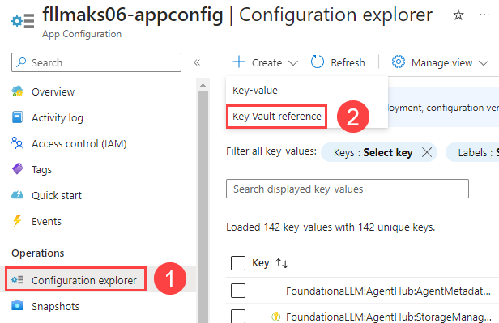
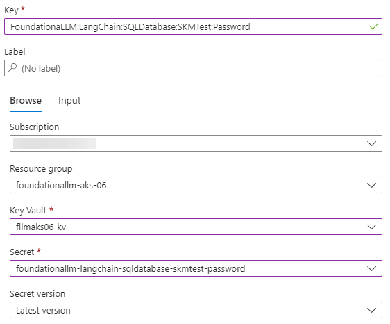

# SQL database agent setup procedures

The following steps should be followed to set up and a SQL database agent with a connection to a SQL database.

The supported SQL database types are:

- Microsoft SQL Server
- PostgreSQL
- MYSQL
- MariaDB

## Backend configuration

Backend configuration includes adding database password values into Azure Key Vault and Azure App Configuration.

### Add Key Vault secret for database

A new secret must be added to Key Vault:

- **Name**: `foundationallm-langchain-sqldatabase-{database-name}-password`, where `{database-name}` is the name of your database
- **Value**: The password for the target SQL database.

    

### Add setting to App Configuration

A new key vault reference app configuration value must be added to Azure App Configuration:

- **Key**: `FoundationaLLM:LangChain:SQLDatabase:{DatabaseName}:Password`, where `{DatabaseName}` is the name of the target database.
- **Secret**: The key vault reference should should point to the key vault secret created above.

To add a Key Vault Reference, navigate to your deployment's App Configuration resource (`-appconfig`). Below **Operations**, select **Configuration explorer**, and create a new **Key Vault reference**.



Select your deployment's Key Vault, the secret you created previously, and the **Latest version** of that secret.



## Blob storage files

The following metadata files should be added to blob storage, and will be used to assemble the agent and underlying data store.

## Data source JSON

To configure the connection to the underlying SQL database, a JSON file should be added into the `data-sources` container in blob storage with the following structure. The file should be saved with a name of `{data-source-name}.json`, where `{data-source-name}` reflects the name of the database or a shortened version of it. As an example, for a database named `weatherdb`, the data source name could be `weather-ds`.

```json
{
    "name": "{data-source-name}",
    "underlying_implementation": "sql",
    "description": "{database-description}",
    "authentication": {
        "authentication_type": "username-password",
        "host": "{database-server-host-name}",
        "port": {port-number},
        "database": "{database-name}",
        "username": "{database-username}",
        "password_secret": "{app-configuration-key-name}"
    },
    "dialect": "{sql-dialect}",
    "few_shot_example_count": 2,
    "row_level_security_enabled": false
}
```

Acceptable values for `authentication.authentication_type` are:

- `username-password`
- `connection-string`

The `password_secret` value should be the **Key** value of the App Configuration setting created above.

Acceptable values for `dialect` are:

- `mariadb` : Use with MariaDB databases
- `mssql` : Use with MS SQL Server database and Azure SQL
- `mysql`
- `postgresql`

## Agent JSON

A JSON file should be added into the `agents` container in blob storage. The name of the file should be the `{agent-name}.json`. For SQL database agents, the file should look like the following:

```json
{
    "name": "{agent-name}",
    "type": "sql",
    "description": "{agent-description}",
    "allowed_data_source_names": [
        {list-of-data-source-names}
    ],
    "language_model": {
        "model_type": "openai",
        "provider": "microsoft",
        "temperature": 0.5,
        "use_chat": true
    }
}
```

The names added to the `allowed_data_source_names` list should be valid data source files in the `data_sources` container, minus the `.json`. For example, if there is a data source file named `weather-ds.json`, the string entered into the `allowed_data_source_names` list would be `"weather-ds"`.

The `temperature` value can be a float between 0.0 and 1.0.

## Prompt text file

The prompt for the agent should be added as a file named `default.txt` into a folder that matches the `{agent-name}` within the `prompts` container.

For SQL databases, the prompt should look similar to the following, where `{enter-description-of-database-and-its-contents}` is replaced with a description of the database and the types of data it contains.

```text
You are a helpful agent designed to {enter-description-of-database-and-its-contents}.

Given an input question, first create a syntactically correct {dialect} query to run, then look at the results of the query and return the answer to the input question.
Unless the user specifies a specific number of examples they wish to obtain, always limit your query to at most {top_k} results using the TOP clause as per {dialect}.
You can order the results by a relevant column to return the most interesting examples in the database. Never query for all the columns from a specific table, only ask for the relevant columns given the question.

You MUST double check your query before executing it. If you get an error while executing a query, rewrite the query and try again.

DO NOT make any DML statements (INSERT, UPDATE, DELETE, DROP etc.) to the database.

If the input question is not related to the database, answer with your name and details about the types of questions you can address.

You have access to tools for interacting with the database. Only use the below tools. Only use the information returned by the below tools to construct your final answer.
```

Starting with `Given an input question...`, updates to the prompt text should be targeted and tested thoroughly, as changes below this point can have significant impacts on the completion responses returned by the agent.
