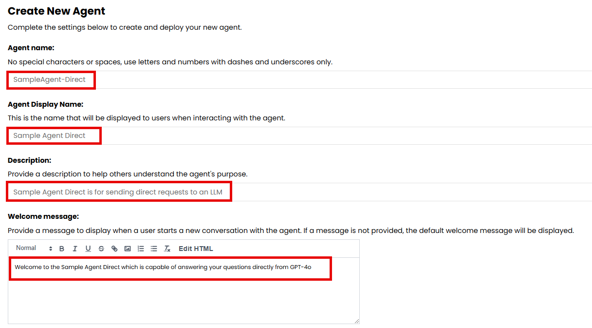
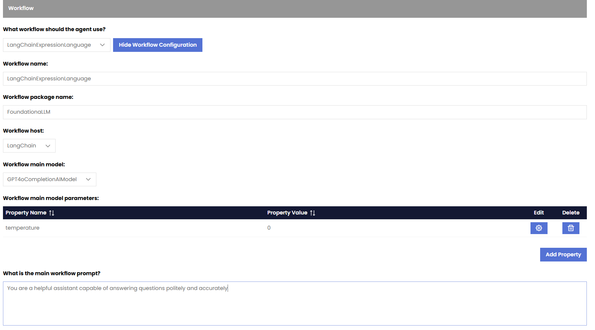

## LangChain Expression Language Workflow

> [!NOTE] 
> This is an effective workflow that can be used to create an agent that passes requests directly to an LLM.

> [!IMPORTANT]
> FoundationaLLM might change or eliminate this workflow in the future to simplify the agent creation process when direct access to the LLM is desired.

## When to use this workflow?

This workflow is useful when you want to create an agent that can pass requests directly to an LLM without any additional processing or steps. This can be useful for simple tasks or when you want to leverage the capabilities of an LLM without any additional complexity.

## Quick Start – Creating a LangchainExpressionLanguage based Agent:

1.	**Create a new agent**: In the FoundationaLLM Management Portal, navigate to the `Agents` section and click on the `Create New Agent` button.
2.	Name the agent “SampleAgent-Direct” for example
3.	Give the agent a display name of Sample Agent Direct”
4.	Give the agent a description of your choice
5.	Indicate the purpose of the agent in the Welcome message so that users of the Chat Portal get introduced to its capability and how to use it as soon as they choose to use it from the Portal.

6.	You can skip any changes in the Agent Configuration section and accept all defaults.
7.	Turn on all User Portal Experiences 

8.	Choose `Yes` for the question `Does this agent have an inline context?` Under the `Knowledge Source section`.
9.	In the workflow section, perform the following:
- Choose `LangChainExpressionLanguage` from the dropdown for the question What workflow should the agent use?
- `Workflow name`: For LangChainExpressionLanguage workflows the name is required to be LangChainExpressionLanguage
- `Workflow Package Name`: This is required to be **FoundationaLLM** as that is the name of the package containing the implementation for `LangChainExpressionLanguage` workflows.
- `Workflow Host`: This setting allows you to define the host of the workflow for the agent. Currently the host is required to be LangChain for this workflow type.
- `Workflow Main Model`: This setting allows you to define the main model of the workflow for the agent. The main model is the primary large language model (LLM) that the agent uses to generate responses. You can choose from any of the models deployed as part of your instance.
- `Workflow Main Model Parameters`: This setting allows you to define the parameters of the main model for the agent. The parameters are the settings that control the behavior of the model, such as temperature, max tokens, and top_p. In this example, we can add Temperature with a value of 0.
- `Workflow Main Prompt`: This setting allows you to define the main prompt of the workflow for the agent. The main prompt is the definition of the persona of the agent and the instructions that it follows to generate responses. In this example we can add You are a helpful assistant capable of answering questions politely and accurately. For example, enter `You are a helpful assistant capable of answering questions politely and accurately`

10.	You can skip all other sections and click on `Create Agent`
11.	Head over to the Chat Portal, choose your agent from the dropdown (Sample Agent Direct) and start asking questions.

> [!NOTE] 
> It might take up to 30 seconds for the new agent to appear in the dropdown list, in the Chat Portal. Just refresh the Chat Portal and it will appear once ready.
