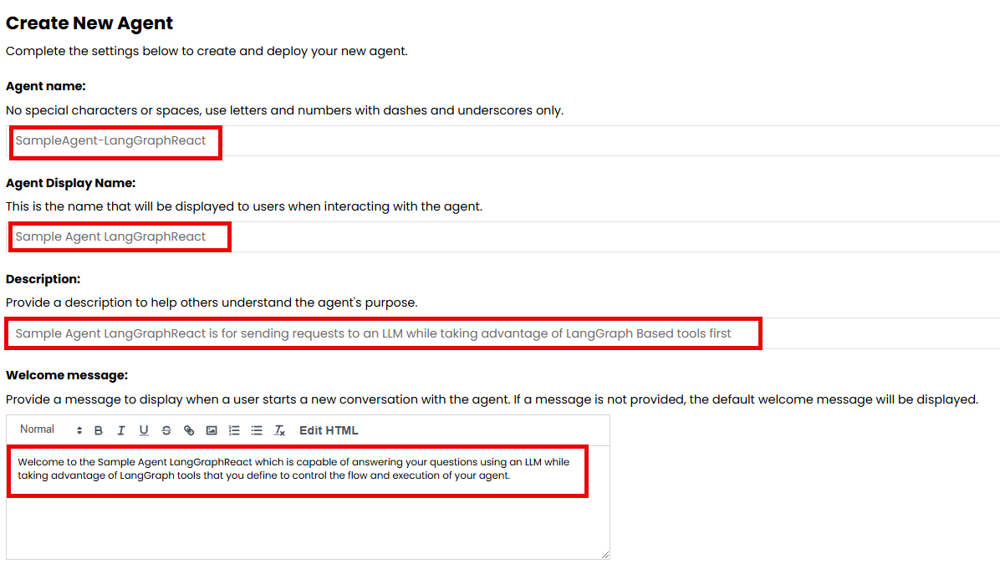
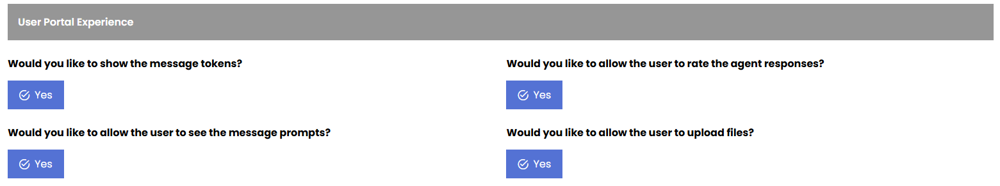
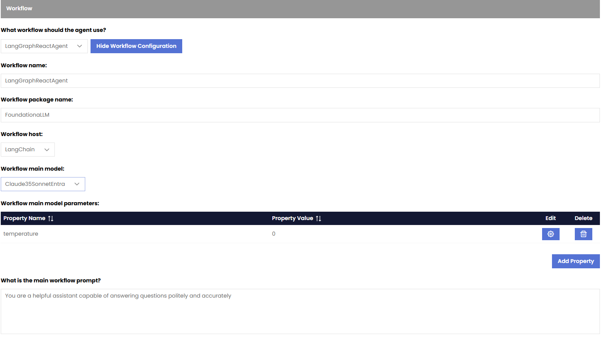
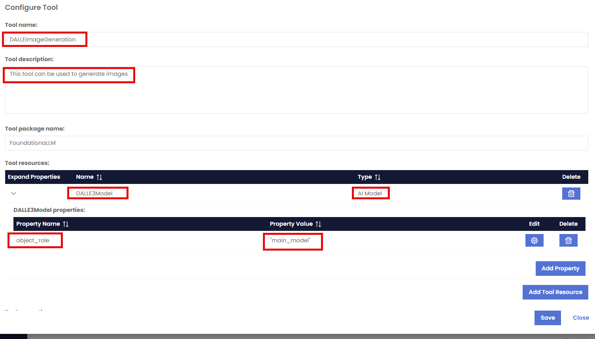
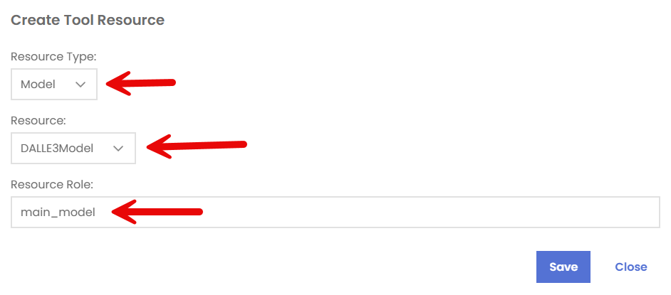
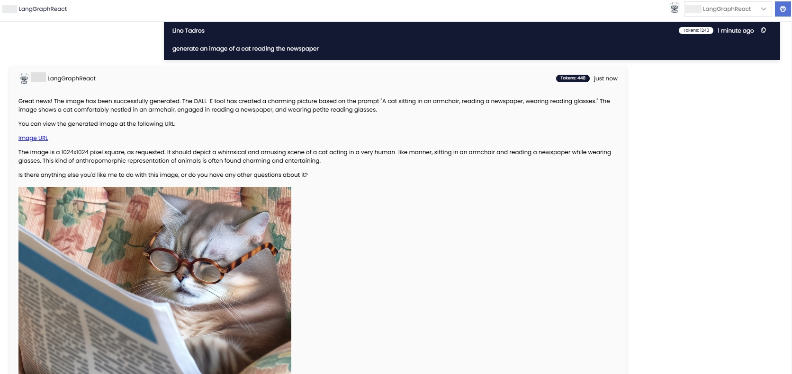

## LangGraphReactAgent Workflow

LangGraph based tools are applications built using the LangGraph framework, which is a library within LangChain designed to create complex, stateful AI agents by representing their workflows as graphs, allowing for intricate interactions between multiple components within an agent system, including branching logic, loops, and the ability to manage state across multiple interactions with users or other agents; essentially enabling developers to build sophisticated AI agents with complex decision-making capabilities by visually mapping out their actions and dependencies as nodes within a graph.

FoundationaLLM allows you to bring in LangGraph based tools that have been developed for LangGraph to take advantage of their functionality and complex logic immediately in a workflow.

As of release `0.9.3`, FoundationaLLM includes two such tools (DALLE3ImageGeneration and ContentSeachTool) as powerful tools to generate images or utilize an existing Vector Store to answer user’s questions.

> [!IMPORTANT]
> More Tools will be available in the future for this workflow to add more capabilities to agents based on this workflow.

## When to use this workflow?

This workflow is useful when you want to create an agent that can dymnically choose the right tool to perform a task based on the user request. This can be useful when the question requires the use of an image generation or seach a vector store predefined and vectorized through the FoundationaLLM vectorization services.

## Quick Start – Creating a LangGraphReact based Agent

1.	Create a new agent: In the FoundationaLLM Management Portal, navigate to the "Agents" section and click on the "Create New Agent" button.
2.	Name the agent “Yale-LangGraphReact” for example
3.	Give the agent a display name of “Yale LangGraphReact”
4.	Give the agent a description of your choice
5.	Indicate the purpose of the agent in the Welcome message so that users of the Chat Portal get introduced to its capability and how to use it as soon as they choose to use it from the Portal.

6.	You can skip any changes in the Agent Configuration section and accept all defaults
7.	Turn on all User Portal Experiences 

8.	Choose Yes for the question Does this agent have an inline context? Under the Knowledge Source section.
9.	In the workflow section, perform the following:
- Choose `LangGraphReactAgent` from the dropdown for the question What workflow should the agent use?
- `Workflow name`: For LangGraphReactAgent workflows the name is required to be LangGraphReactAgent
- `Workflow Package Name`: This is required to be “FoundationaLLM” as that is the name of the package containing the implementation for LangGraphReactAgent workflows.
- `Workflow Host`: This setting allows you to define the host of the workflow for the agent. Currently the host is required to be LangChain for this workflow type.
- `Workflow Main Model`: This setting allows you to define the main model of the workflow for the agent. The main model is the primary large language model (LLM) that the agent uses to generate responses. In this example, we chose `Claude35SonnetEntra` as the main model for the agent
- `Workflow Main Model Parameters`: This setting allows you to define the parameters of the main model for the agent. The parameters are the settings that control the behavior of the model, such as temperature, max tokens, and top_p. In this example, we can add Temperature with a value of 0.
- `Workflow Main Prompt`: This setting allows you to define the main prompt of the workflow for the agent. The main prompt is the definition of the persona of the agent and the instructions that it follows to generate responses. In this example we can add You are a helpful assistant capable of answering questions politely and accurately. For example, enter `You are a helpful assistant capable of answering questions politely and accurately`

10.	In the Tools section, under the `What tools should the agent use?` you can define the tools that the agent can use to perform tasks and provide responses. The tools are LanGraph tools that the agent can call to retrieve information or perform actions.
11.	Click on the Add New Tool button.

12.	Let's incorporate the DALLE3 Image Generation tool into our agent. This tool is based on the DALLE3 model and allows you to generate images from text prompts.

13.	The Tool name has to be `DALLEImageGeneration` in order for the agent to be able to use it.
14.	The Tool Description is very important as it is used by the agent to determine which tool to use during execution.
15.	The Tool Package Name is set to FoundationaLLM as this is where the implementation of the tool is located.
16.	In the Tool Resources section:
- Add a `Model` resource and point it to your desired LLM model (DALLE3Model in this case). 
- The Resource Role has to be set to `main_model` in the Tool Resources section.

17.	No other setting is needed for this DALLE3 tool.

> [!NOTE]
>  For this release, instead of conducting embedding and vectorization for a set of documents outside of the agent then using this workflow with the ContentSearchTool to point to your index, it is encouraged to use the Private Storage previously documented in this article to include documents for search during an agent’s conversation with a user. In the future, both methods will be available based on preference and circumstances.

18.	Click on Create Agent
19.	Head over to the Chat Portal, choose your agent from the dropdown.
20. Start a conversation with your agent and ask questions to see the `DALLEImageGeneration` tool utilized, like `generate an image of a cat reading the newspaper` and see the agent using the DALLE3 tool to generate the image.

> [!NOTE]
> It might take up to 30 seconds for the new agent to appear in the dropdown list, in the Chat Portal. Just refresh the Chat Portal and it will appear once ready.

