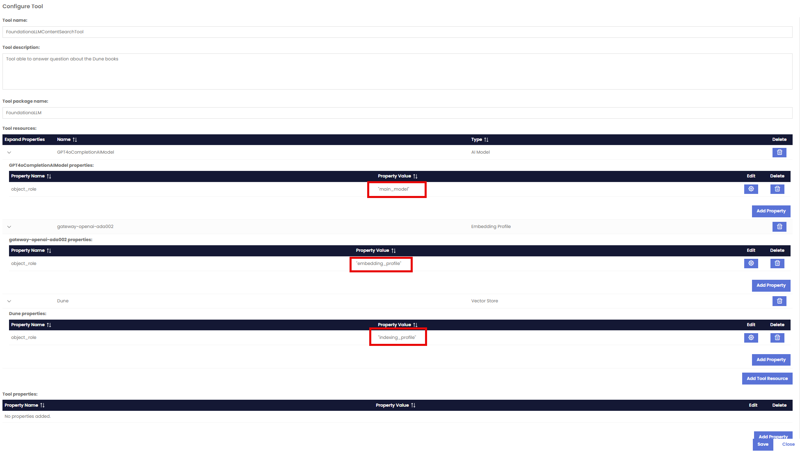

## LangGraphReactAgent Workflow

> [!NOTE] 
> This is a powerful workflow that can be used to create an agent that has access to LangGraph based Tools like **DALLE Image Generation** and the **FoundationaLLM Content Search Tool** to search vectore stores predefined and vectorized through the FoundationaLLM vectorization services.

> [!IMPORTANT]
> More Tools will be available in the future for this workflow to add more capabilities to agents based on this workflow.

## When to use this workflow?

This workflow is useful when you want to create an agent that can dymnically choose the right tool to perform a task based on the user request. This can be useful when the question requires the use of an image generation or seach a vector store predefined and vectorized through the FoundationaLLM vectorization services.

## Creating a sample agent using this workflow

**Create a new agent**: In the FoundationaLLM Management Portal, navigate to the "Agents" section and click on the "Create New Agent" button.

### General Section

In this section, you can define the name, description and welcome message of the agent.  The Welcome message is what a user will see in the Chat portal as soon as they pick that agent from the dropdown to learn about the agent and its services that it provides before starting a chat conversation.

### Knoweldge Source

Choose `Yes` for the question **Does this agent have an inline context?**

### Agent Configuration Section

In this section, you can define the following configurations:

- **Chat History**: This setting allows you to enable or disable the chat history feature for the agent. When enabled, the agent will remember the context of previous conversations, allowing for more personalized and relevant responses. If disabled, the agent will not retain any memory of past interactions. It also allows you to define the number of messages to be stored in the chat history. The default is 5 messages.

- **Gatekeeper**: This setting allows you to enable or disable the gatekeeper feature for the agent. When enabled, the agent will have a gatekeeper that can filter and moderate the content of conversations, ensuring that inappropriate or harmful content is not generated. If disabled, the agent will not have any content moderation capabilities. 
You can choose from multiple options for the content safety:
  - **Azure Content Safety**
  - **Azure Content Safety Prompt Shield**
  - **Lakera Guard**
  - **Enkrypt Guardrails**
The Gatekeeper also allows you to enable the Data Protection aspect of the agent, which currently uses **Microsoft Presidio** to filter sensitive data in the conversations.

- **Cost Center**: This setting allows you to define a cost center for the agent. A cost center is a department or unit within an organization that is responsible for its own expenses and budget. By assigning a cost center to the agent, you can track and manage the costs associated with its operations.

- **Expiration**: This setting allows you to define an expiration date for the agent. After this date, the agent will no longer be available for use. This is useful for managing the lifecycle of agents and ensuring that they are only active when needed.

- **Chat Portal Displays**: This setting allows you to turn on or off 4 valuable capabilities in the **Chat Portal**.
  - The amount of **tokens** used in the conversation. (Questions and Responses)
  - The **prompt** used by the agent for a specific question including history and context.
  - The option to rate the response of the agent.
  - The ability to allow the user to upload files to the agent in the conversation.

### Workflow Section

1. Choose `LangGraphReactAgent` from the dropdown for the question **What workflow should the agent use?**
2. **Workflow name**: This setting allows you to define the name of the workflow for the agent. The name should be descriptive and reflect the purpose of the workflow.
3. **Workflow Package Name**: This setting allows you to define the name of the workflow package for the agent. The package name should be descriptive and reflect the purpose of the workflow. Currently, the package name is set to `FoundationaLLM` as this is where the implementation of the workflow is located.
4. **Workflow Host**: This setting allows you to define the host of the workflow for the agent. Currently the host is required to be **Langchain** for this workflow type. More orchestration types will be added in the future for workflows.
5. **Workflow Main Model**: This setting allows you to define the main model of the workflow for the agent. The main model is the primary large language model (LLM) that the agent uses to generate responses. You can choose from any of the models deployed as part of your instance.
6. **Workflow Main Model Parameters**: This setting allows you to define the parameters of the main model for the agent. The parameters are the settings that control the behavior of the model, such as temperature, max tokens, and top_p.  In this example, we can add `Temperature` with a value of `0`.
7. **Workflow Main Prompt**: This setting allows you to define the main prompt of the workflow for the agent. The main prompt is the definition of the persona of the agent and the instructions that it follows to generate responses. In this example we can add `You are a helpful assistant capable of answering questions politely and accurately`

## Tools Section:

In the **Tools** section, under the `What tools should the agent use?`, you can define the tools that the agent can use to perform tasks and provide responses. The tools are LanGraph tools that the agent can call to retrieve information or perform actions.
1. Click on the `Add New Tool` button.

2. Let's incorprate the DALLE3 Image Generation tool to our agent. This tool is based on the **DALLE3** model and allows you to generate images from text prompts. 

3. The `Tool Name` currently has to be `DALLEImageGeneration` in order for the agent to be able to use it. 
4. The `Tool Description` is very important as it is used by the agent to determine which tool to use during execution.
5. The `Tool Package Name` is set to `FoundationaLLM` as this is where the implementation of the tool is located.
6. The AI Model's Object role has to be **main_model** in the **Tool Resources** section.
7. No other setting is needed for this DALLE3 tool.
8. Let's also add a second tool for the **FoundationaLLM Content Search Tool** to search a vector store predefined and vectorized through the FoundationaLLM vectorization services.
 
 
 
9. The `Tool Name` currently has to be `FoundationaLLMContentSearchTool` in order for the agent to be able to use it.  This will change in the future to allow for more flexibility in the naming of the tools.
10. The `Tool description` is very important as it is used by the agent to determine which tool to use during execution.
11. The `Tool Package Name` is set to `FoundationaLLM` as this is where the implementation of the tool is located. 
12. In the **Tool Resources** section:
  - Add an **AI Model** resource and point it to your deseired LLM model. The AI Model's Object role has to be **main_model** in the **Tool Resources** section.
  - Add an **Embedding Profile** resource and point it to your deseired embedding model. The Embedding Profile's Object role has to be **embedding_profile** in the **Tool Resources** section.
  - Add an **indexing_profile** resource and point it to your deseired indexing profile. The Indexing Profile's Object role has to be **indexing_profile** in the **Tool Resources** section.  In this example, we are using a pre-vectorized index called `Dune` that has an index for al the books of Dune available to ask questions about.
13. No other setting is needed for this Content Search tool.
14. Click on `Create Agent` 
15. Head over to the **Chat Portal**, choose your agent from the dropdown.
16. Start a conversation with your agent and ask multiple question to see the tools being picked automatically by agent:
 - Ask the agent to generate an image of a cat and see the agent using the **DALLE3** tool to generate the image.
 - Ask the agent `Who is Paul Atreides?` and see the agent using the **FoundationaLLM Content Search Tool** to search the `Dune` vector store and provide you with an answer.
