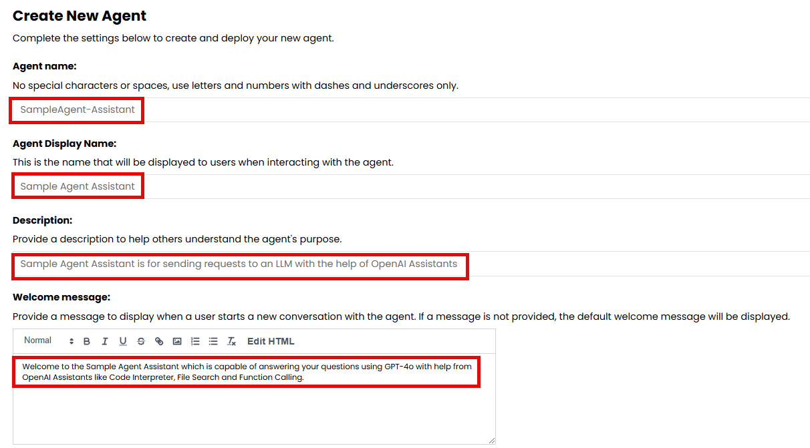
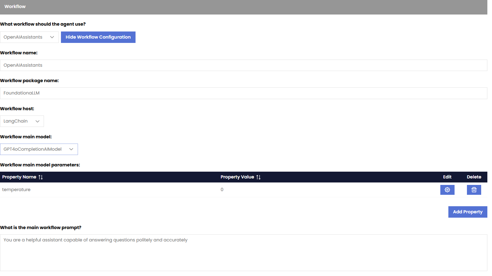
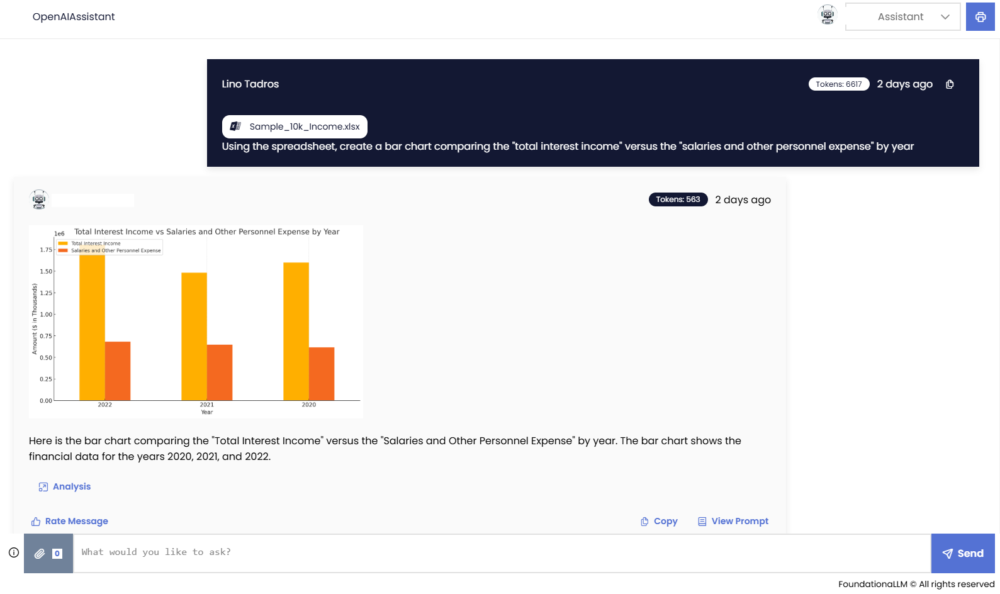
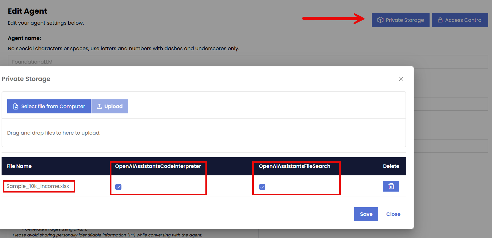

## OpenAI Assistants Workflow

> [!NOTE] 
> This is a powerful workflow that can be used to create an agent that passes requests directly to an LLM and adding OpenAI Assistants capabilities like **Code Interpreter**, **File Search** and **Function Calling**.

## When to use this workflow?

This can be useful when the question requires a more complex processing or code analysis. For example, if the question asked requires the dynamic generation and execution of code in support of answering the user prompt, or uploading a document that requires searching on the fly to retrieve relevant answers within the conversation context without prior vectorization.

## Quick Start – Creating an OpenAIAssistant based Agent

1.	Create a new agent: In the FoundationaLLM Management Portal, navigate to the `Agents` section and click on the "Create New Agent" button.
2.	Name the agent “Sample-Agent-Assistant” for example
3.	Give the agent a display name of Sample Agent Assistant”
4.	Give the agent a description of your choice
5.	Indicate the purpose of the agent in the Welcome message so that users of the Chat Portal get introduced to its capability and how to use it as soon as they choose to use it from the Portal.

6.	You can skip any changes in the Agent Configuration section and accept all defaults, but please remember that when using an OpenAIAssistants workflow, the conversation History Maximum Messages behaves differently and is not considered in this context as OpenAIAssitants manage their own threads.
7.	Turn on all User Portal Experiences 

8.	Choose `Yes` for the question `Does this agent have an inline context?` Under the `Knowledge Source` section.
9.	In the workflow section, perform the following:
- Choose `OpenAIAssistants` from the dropdown for the question `What workflow should the agent use?`
- `Workflow name`: For OpenAIAssistants workflows the name is required to be OpenAIAssistants
- `Workflow Package Name`: This is required to be “FoundationaLLM” as that is the name of the package containing the implementation for OpenAIAssistants workflows.
- `Workflow Host`: This setting allows you to define the host of the workflow for the agent. Currently the host is required to be LangChain for this workflow type.
- `Workflow Main Model`: This setting allows you to define the main model of the workflow for the agent. The main model is the primary large language model (LLM) that the agent uses to generate responses. You can choose from any OpenAI based Models like GPT-4, GPT-4o, GPT-o1 and others.
- `Workflow Main Model Parameters`: This setting allows you to define the parameters of the main model for the agent. The parameters are the settings that control the behavior of the model, such as temperature, max tokens, and top_p. In this example, we can add Temperature with a value of 0.
- `Workflow Main Prompt`: This setting allows you to define the main prompt of the workflow for the agent. The main prompt is the definition of the persona of the agent and the instructions that it follows to generate responses. In this example we can add You are a helpful assistant capable of answering questions politely and accurately. For example, enter `You are a helpful assistant capable of answering questions politely and accurately`

10.	You can skip all other sections and click on `Create Agent`
11.	Head over to the Chat Portal, choose your agent from the dropdown (Yale Assistant) and start asking questions.
12.	In my example, I uploaded a sample 10k financial file and asked the a question `Using the spreadsheet, create a bar chart comparing the "total interest income" versus the "salaries and other personnel expense" by year` which requires the invocation of the Code Interpreter in OpenAI Assistant to open the file, analyze its content and generate Python based code to create the bar chart as you can see below in the screenshot

> [!NOTE]
> It might take up to 30 seconds for the new agent to appear in the dropdown list, in the Chat Portal. Just refresh the Chat Portal and it will appear once ready.

13.	When the response is ready, you can click on the `Analysis` hyperlink at the bottom of the response to see the OpenAI Assistants Code Interpreter tool reasoning and code generated to perform your query.

> [!NOTE]
> One of the great features of FoundationaLLM is the ability to upload files and documents to a Private Storage for the agent

You will be able to upload documents from your computer like PDFs, docs, xlsx, and others… and utilize the power of Code Interpreter and File Search in OpenAIAssistant to analyze and execute against these files that are only available to the agent being created.
