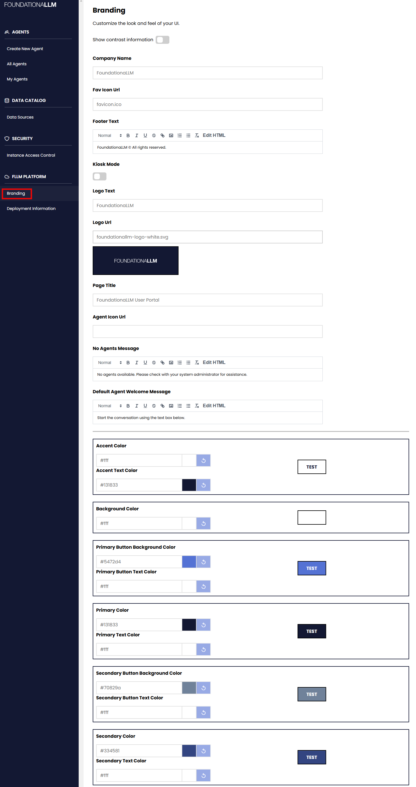
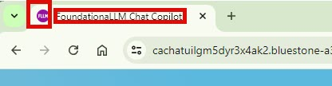
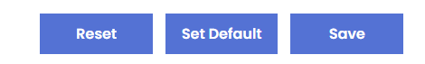
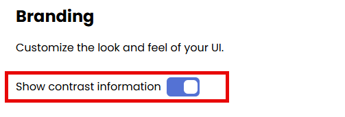
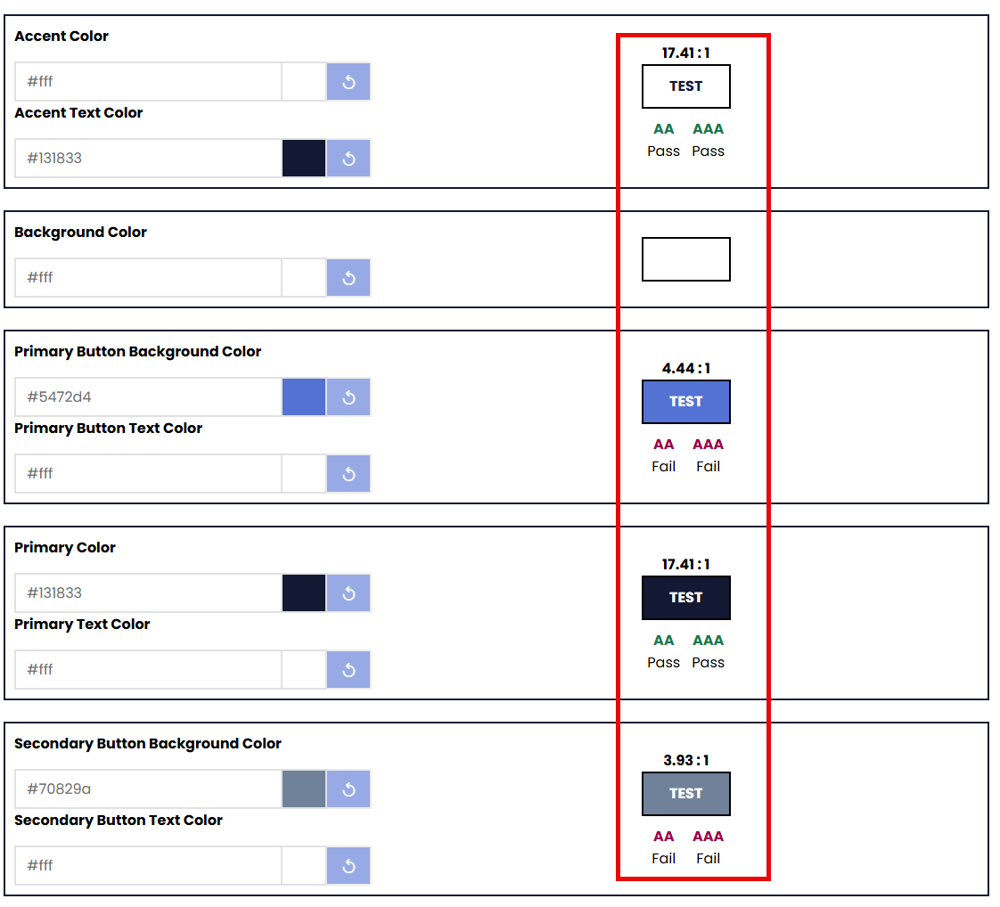

## Company Name
Not in use.  Reserved for future enhancements.

## Fav Icon Url
A string value to set the FavIcon Url which is displayed in the browser tab.
> [!IMPORTANT]
> The FavIconUrl can be an SVG or PNG image placed in the Public folder of the application's source code but will require rebuilding of the docker image to reflect the changes. The preferred ways of setting the FavIconUrl is to set it to a relative accessible public URL to an SVG or PNG image or include the full Base64 encoded image in the textbox directly.Any changes to the `Fav Icon Url` will require a restart of the `CoreAPI` image to take effect.

## Footer Text
A string value to set the Footer Text value which is displayed at the bottom right of the screen. You can edit the text in the HTML editor as well to include special characters like ©.

## Kiosk Mode
This is a boolean flag to indicate if the application is running in kiosk mode, if true will remove the sessions panel on the left navigation panel. 
Kiosk mode does not store user conversations and is meant to be used within a public kiosk setting

## Logo Text
A string value to set the Logo Text value which is displayed only if the `Logo Url` is not set.

## Logo Url
A string value to set the Logo Url which is displayed in top left header and also in the login screen.
> [!IMPORTANT]
> The Logo Url can be an SVG or PNG image placed in the Public folder of the application's source code but will require rebuilding of the docker image to reflect the changes. The preferred ways of setting the Logo Url is to set it to a relative accessible public URL to an SVG or PNG image or include the full Base64 encoded image in the textbox directly. A preview of the image will show up underneath the textbox.

## Page Title
A string value to set the Page Title value which is displayed in the browser tab.

> [!IMPORTANT]
> Any changes to the `Page Title` will require a restart of the `CoreAPI` image to take effect.

## Agent Icon Url
A string value to set the Agent Icon Url which is displayed in the chat window.

> [!IMPORTANT]
> The `Agent Icon Url` can be an SVG or PNG image placed in the Public folder of the application's source code but will require rebuilding of the docker image to reflect the changes. The preferred ways of setting the LogoUrl is to set it to a relative accessible public URL to an SVG or PNG image or include the full Base64 encoded image in the textbox directly.

## No Agents Message
A string value to set the No Agents Message value which is displayed in the chat window when no agents are available. HTML allowed in this field.

## Default Agent Welcome Message
A string value to set the Default Agent Welcome Message value which is displayed in the chat window when the agent is connected. HTML allowed in this field.
Agents can have their own welcome message. If the selected agent does not have a configured welcome message, the Default Agent Welcome Message is displayed. It's also displayed when no agent is selected.

## Accent Color
Takes a hexadecimal or RGB color value to set the accent color of the chat application which is used for top header and the the token counter in the chat. You can use the color picker to choose a color

## Accent Text Color
Takes a hexadecimal or RGB color value to set the accent text color of the chat application which is used for top header and the the token counter in the chat. You can use the color picker to choose a color

## Background Color
Takes a hexadecimal or RGB color value to set the background color of the chat application. You can use the color picker to choose a color

## Primary Button Background Color
Takes a hexadecimal or RGB color value to set the Primary Button Background color of the chat application. It affects the `Send` button in the chat at the bottom right, the `Close` button the `View Prompt` screen and the `login` button in the login screen. You can use the color picker to choose a color

## Primary Button Text Color
Takes a hexadecimal or RGB color value to set the Primary Button Text color of the chat application. It affects the `Send` button in the chat at the bottom right, the `Close` button the `View Prompt` screen and the `login` button in the login screen. You can use the color picker to choose a color

## Primary Color
Takes a hexadecimal or RGB color value to set the Primary color of the chat application. It affects the left navigation panel and the `User Message` panel in the chat. You can use the color picker to choose a color

## Primary Text Color
Takes a hexadecimal or RGB color value to set the Primary Text color of the chat application. It affects the left navigation panel and the `User Message` panel in the chat. You can use the color picker to choose a color

## Secondary Button Background Color
Takes a hexadecimal or RGB color value to set the Secondary Button Background color of the chat application. It affects the `collapsable arrow` in the left navigation panel, the `Sign Out` bottom at the bottom and the `attachment` of files button in the chat window.
You can use the color picker to choose a color

## Secondary Button Text Color
Takes a hexadecimal or RGB color value to set the Secondary Button Text color of the chat application. It affects the `collapsable arrow` in the left navigation panel, the `Sign Out` bottom at the bottom and the `attachment` of files button in the chat window.
You can use the color picker to choose a color

## Secondary Color
Takes a hexadecimal or RGB color value to set the Secondary color of the chat application. It affects the background color of the `session identifier` in the left navigations panel and the background of the entire `login screen`.
You can use the color picker to choose a color

## Secondary Text Color
Takes a hexadecimal or RGB color value to set the Secondary Text color of the chat application. It affects the background color of the `session identifier` in the left navigations panel.
You can use the color picker to choose a color

## Saving, resetting and Setting Default

At the bottom of the branding page, you will find the  `Reset`, `Set Default` and `Save` buttons.
- Reset: Returns any changed values to what they were before you changed them while editing the form.
- Set Default: This sets the branding values to the default out-of-the-box FoundationaLLM branding settings.
- Save: This will save the current values and apply them to the chat application.

## Show Contrast Information

At the top of the branding page, you will find the `Show Contrast Information` toggle button. This will show the contrast information of the current branding settings. 

AA and AAA are levels of color contrast for web pages that indicate how readable the text is: 
- `AA`: The minimum contrast ratio for normal text is 4.5:1, and 3:1 for large text. This level is considered a passing grade, but it might still be difficult for some users to read. 

- `AAA`: The contrast ratio for normal text is 7:1, and 4.5:1 for large text. This level is considered to create the most accessible content and best user experience. 
 
Color contrast is important for legibility, especially for users with color blindness or other conditions that make it difficult to differentiate between colors. The Web Content Accessibility Guidelines (WCAG) recommend these contrast ratios to help designers create readable interfaces. 
While Level AAA is recommended, it's not required for all sites. The best approach is to consider your organization, the purpose of your content, and your typical users. 