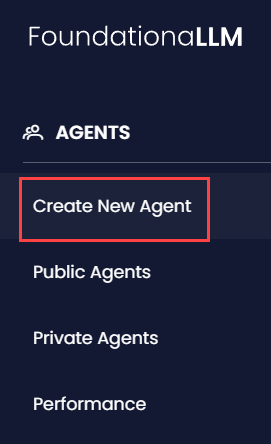
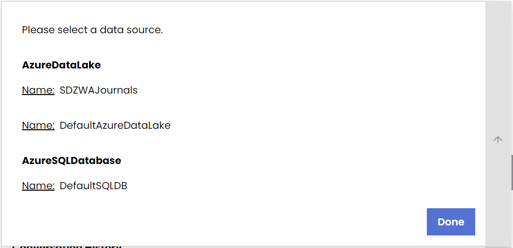

# Management UI

The Management UI enables FLLM administrators to configure agents without directly calling the Management API.

## Creating New Agent

1. Navigate to the **Create New Agent** page using the side navigation bar.
    
    

2. Set the agent type: **Knowledge Management** or **Analytics**.

    

3. Set the agent Knowledge Source:

    

     - Expand the dropdown arrow next to the upper left box. Select the entry with the correct **Storage account name**, artifacts **Container name**, and file **Data Format(s)**. Then, select **Done**.

        

     - Expand the dropdown arrow next to the upper right box to open the Azure AI Search index dropdown. The vectorized content will be populated in the selected index. Select **Done**.

        
     
     - Expand the dropdown arrow next to the lower left box. Set the **Chunk size** and **Overlap size** settings for vectorization. Select **Done**.

        

     - Expand the dropdown arrow next to the lower right box. Set the trigger **Frequency** and select **Done**.

        

4. Configure user-agent interactions.

    

    - Enable conversation history using the `Yes/No` Radio Button. Select **Done**.

        

    - Configure the Gatekeeper. Then, select **Done**.
        - `Enable/Disable` the Gatekeeper using the Radio Button
        - Set the **Content Safety** platform to either `None` or `Azure Content Safety` using the dropdown menu
        - Set the **Data Protection** platform to either `None` or `Microsoft Presidio` using the dropdown menu

        

5. Lastly, set the **System Prompt**. The prompt prefixes users' requests to the agent, influencing the tone and functionality of the agent.

    

6. After setting the desired agent configuration, select **Create Agent** at the bottom right-hand corner of the page. You will be able to edit the agent configuration after creation.
